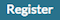
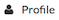
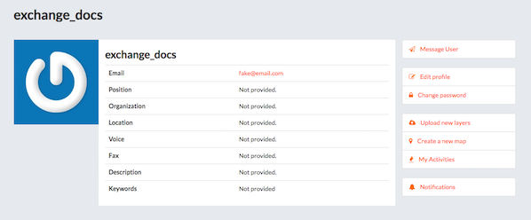
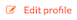
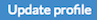
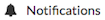
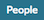
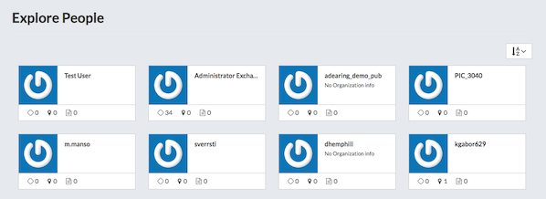
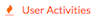
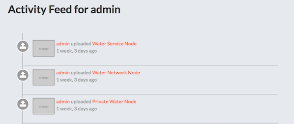

## Accounts and Users
---
Exchange is a social platform, and thus a primary component of any Exchange instance is the user account.

### Creating a New Account
---
Depending on how the Exchange instance was configured, you may have to register for an account. If the  link is not displayed, then you will need to contact the Site Systems Administrator to have an account created.

If the  link is displayed then register a new account by completing the following steps:

1. Select the  link and fill out all fields in the following form.

    

2. Depending on how the Exchange Site was configured you may have to confirm your email. If that is the case follow the steps listed in the email once it is received.

### Managing Your Profile
---
Your profile is your Exchange page that describes your point of contacts, interests, and other related content you may want to publish.

To adjust your profile settings complete the following steps:

1. Select on your user name in the top right of the screen. A drop-down list will show. Click on  to enter the Profile Settings page. This will display the current profile settings.

    

2. To adjust the settings, select the  link.

3. On this page, you can update your information, including your avatar. It is __important__ to ensure you have at a minimum your __First name__, __Last name__ and __Email address__. This is required for proper displaying of history from GeoGig versioned layers.

    

4. When finished, select the  button.

### Setting Notification Preferences
---
By default Exchange sends __email__ notifications to the users for events that the users could be subscribed such as a new layer uploaded or a new rate added to a map.

To adjust the default settings complete the following steps:

1. Select on your user name in the top right of the screen. A drop-down list will show. Click on  to enter the Notifications Settings page.

2. Make sure to have a verified email address to which notices can be sent. If not, click on the proposed link to add one.

3. Now check/uncheck the notification types you wish to receive or not receive. It is possible to be notified for the following events:

    * Layer Created
    * Layer Updated
    * Layer Deleted
    * Rating for Layer
    * Comment for Layer
    * Map Created
    * Map Updated
    * Map Deleted
    * Rating for Map
    * Comment for Map
    * Document Created
    * Document Updated
    * Document Deleted
    * Rating for Document
    * Comment for Document
    * User following you
    * Request to download a resource

### Viewing Other User Accounts
---
Once your account is created in Exchange, you can view other accounts on the system. To see information about other users on the system complete the following steps:

1. Select the  link on the top toolbar. You will see a list of thumbnails for all users registered on this system. The thumbnails will display the avatar f the user if one was provided.

    

2. Click on the user name for a particular user. You will see the resources owned by this user.

    

3. You can also click on  to see the chronological list of that user’s activities.

    
