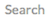
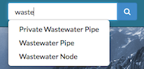
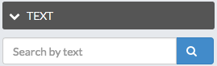
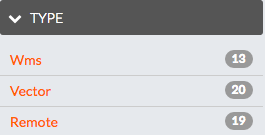
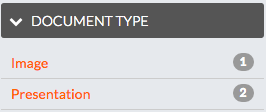
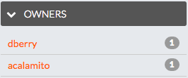
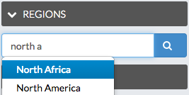

## Content Discovery in Exchange
---
### Local Content
---
1. __Exchange Search__ - You will find the  field at the top of every Exchange page. When you type in the  field, Exchange will list the Layers, Maps, and Documents that match the text you’ve entered. Select on the word in the list to go to that resource.

    

2. __Browsing Layers__ - The Layers page lets you browse data that has been uploaded to this GeoNode. From the Layers page, you can see how many times a layer has been viewed and it’s average user rating. You can also Download the layer data, create a map, or go to a the layer detail page.

3. __View by Layer Type__ - The view in the layers page can be subset by Raster or Vector.

4. __Browsing Maps__ - The Maps page lets you browse data that has been uploaded to this GeoNode. From the Maps page, you can see how many times a map has been viewed and it’s average user rating. You can also Download the layers for the map, view the map, or go to a the map detail page for more information.

5. __Filtering Results__ - There are several different ways to manage the list of the maps, layers or documents you’re viewing. The Layers, Maps and Documents pages provide the ability to filter by categories, date range, or keywords.

    * __Filter by Text__ - Just as the  field, Filter by Text will filter the results by text you've entered.

        

    * __Filter by Type__ _(Layers Page Only)_ - You can filter results by Raster, Remote, Vector and WMS.

        

    * __Filter by Document Type__ _(Documents Page Only)_ - You can filter results by a specific Document Type.

        

    * __Filter by Category__ - You can filter Layers or Maps by Categories. When the metadata for a layer or a map has been tagged with a specific category, it will be reflected in the Categories panel. Clicking on the first category limits the layer list to those tagged with that category. Clicking on another category adds the layers from that category to the layer list. Clicking on the category again will remove it from the layer list.

        

    * __Filter by Keywords__ - You can filter the Layers or Maps associated with a particular keyword. The keywords are saved in the metadata. To edit the keywords for an item you need to go to the Edit Metadata tab for the specific item (map, layer or document).

        

    * __Filter by Owners__ - You can filter the Layers or Maps by a specific user that owns the data.

        

    * __Filter by Date__ - You can limit the list of layers or maps by a date range. In the Date panel select the start date and the end date for the date range. The view will update to reflect those layers or maps that were created within that timeframe.

        

    * __Filter by Regions__ - You can filter also by entering a geographical region.

        

    * __Filter by Extent__ - You can filter by extent using the search overview map.

        

### Search by CSW
---
* TODO
