## Content Discovery in Exchange
---
### Local Content
---
1. __Exchange Search__ - You will find the  field at the top of every Exchange page. When you type in the  field, Exchange will list the Layers, Maps, and Documents that match the text you’ve entered. Select on the word in the list to go to that resource.

    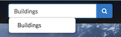

2. __Browsing Layers__ - The Layers page lets you browse data that has been uploaded to this GeoNode. From the Layers page, you can see how many times a layer has been viewed and it’s average user rating. You can also Download the layer data, create a map, or go to a the layer detail page.

3. __View by Layer Type__ - The view in the layers page can be subset by Raster or Vector.

4. __Browsing Maps__ - The Maps page lets you browse data that has been uploaded to this GeoNode. From the Maps page, you can see how many times a map has been viewed and it’s average user rating. You can also Download the layers for the map, view the map, or go to a the map detail page for more information.

5. __Filtering Results__ - There are several different ways to manage the list of the maps, layers or documents you’re viewing. The Layers, Maps and Documents pages provide the ability to filter by categories, date range, or keywords.

    * __Filter by Text__ - Just as the  field, Filter by Text will filter the results by text you've entered.

        

    * __Filter by Type__ _(Layers Page Only)_ - You can filter results by Raster, Remote, Vector and WMS.

        

    * __Filter by Document Type__ _(Documents Page Only)_ - You can filter results by a specific Document Type.

        

    * __Filter by Category__ - You can filter Layers or Maps by Categories. When the metadata for a layer or a map has been tagged with a specific category, it will be reflected in the Categories panel. Clicking on the first category limits the layer list to those tagged with that category. Clicking on another category adds the layers from that category to the layer list. Clicking on the category again will remove it from the layer list.

        

    * __Filter by Keywords__ - You can filter the Layers or Maps associated with a particular keyword. The keywords are saved in the metadata. To edit the keywords for an item you need to go to the Edit Metadata tab for the specific item (map, layer or document).

        

    * __Filter by Owners__ - You can filter the Layers or Maps by a specific user that owns the data.

        

    * __Filter by Date__ - You can limit the list of layers or maps by a date range. In the Date panel select the start date and the end date for the date range. The view will update to reflect those layers or maps that were created within that timeframe.

        

    * __Filter by Regions__ - You can filter also by entering a geographical region.

        

    * __Filter by Extent__ - You can filter by extent using the search overview map.

        

###Registry Catalogue Service for the Web (CSW)
CSW (Catalogue Service for the Web) is an OGC (Open Geospatial Consortium) specification that defines common interfaces to discover, browse, and query metadata about data, services, and other potential resources.

Registry provides access to its catalog via the CSW standard for both first-order and all metadata for harvested data, services and applications. The first-order CSW endpoint provides collection level filtering of all metadata records. The all metadata CSW endpoint provides all levels of metadata at varying levels of granularity.

Any client supporting CSW (desktop, GIS, web application, client library, etc.) can integrate the Registry CSW endpoints.

###Interacting with the Registry CSW

The Registry CSW endpoints are implemented using pycsw. pycsw is an OGC CSW server implementation written in Python, enabling the publishing and discovery of data and services, providing a standards-based metadata and catalogue component of spatial data infrastructures. pycsw is Certified OGC Compliant and is an OGC Reference Implementation.

###Registry CSW endpoints

The Registry CSW endpoints support the OGC CSW 2.0.2 standard as well as the ISO Metadata Application 1.0.0 Profile. The CSW endpoints operate over HTTP GET, POST (XML) and SOAP.

###Making HTTP POST (XML) requests

While making HTTP GET requests is relatively straightforward, HTTP POST (XML) requests require the client to open the connection and send the request XML as the payload. Below are a few examples on how to run HTTP POST (XML) requests on the command line:

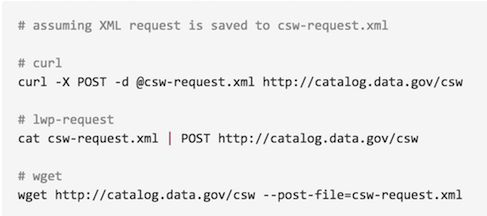

###Service Endpoints

First-order metadata: http://exchange-dev.boundlessps.com/registry/search

We will use the first-order CSW endpoint for the examples below.

###GetCapabilities

The __GetCapabilities__ operation provides CSW clients with service metadata about the CSW service as an XML document.

__Examples:__

__HTTP GET:__ http://exchange-dev.boundlessps.com/registry/search/csw?service=CSW&version=2.0.2&request=GetCapabilities

__HTTP POST (XML):__

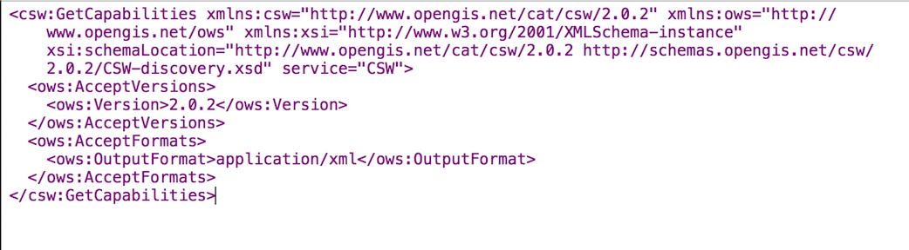

###DescribeRecord

The DescribeRecord operation provides CSW clients with elements of supported information models of the CSW service.

__Examples:__

__HTTP GET:__
http://exchange-dev.boundlessps.com/registry/search/csw?service=CSW&version=2.0.2&request=DescribeRecord

__HTTP POST (XML):__

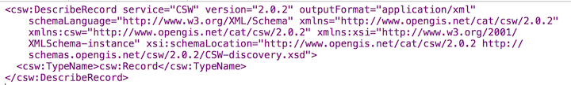

###GetDomain

The GetDomain operation provides an interface to return all possible values for a given metadata property/queryable or parameter.

__Examples:__

__HTTP GET:__ http://exchange-dev.boundlessps.com/registry/search/csw?service=CSW&version=2.0.2&request=GetDomain&propertyname=dc:type

http://exchange-dev.boundlessps.com/registry/search/csw?service=CSW&version=2.0.2&request=GetDomain&parametername=GetRecords.outputSchema

__HTTP POST (XML):__

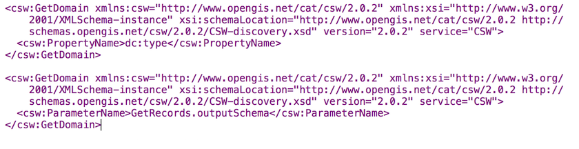

###GetRecords

The GetRecords operation provides a query interface to search for data both using spatial predicates as well as attribute / temporal queries, or both. GetRecords queries are best invoked as HTTP POST (XML). Examples:

Notes:

- Adjust the startPosition and maxRecords parameters to customize / page responses

- Adjust the optional outputSchema parameter to customize output format (default is Dublin Core [http://www.opengis.net/cat/csw/2.0.2], use http://www.isotc211.org/2005/gmd for ISO)

- Bounding box queries and responses always use axis order latitude longitude

- Adjust the optional csw:ElementSetName parameter (brief, summary [default], full) to adjust verbosity of metadata record responses. The following table provides an overview of the elements returned:

Returnable elements

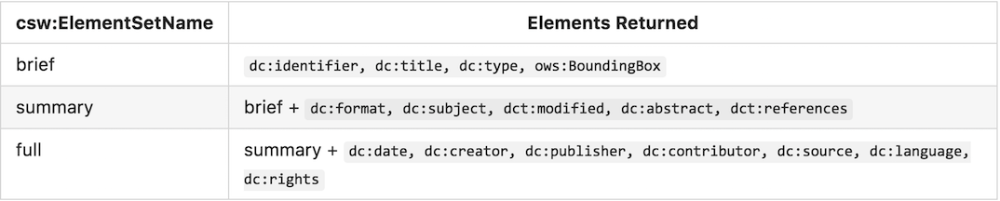

####Query all records, return records 1 - 15:

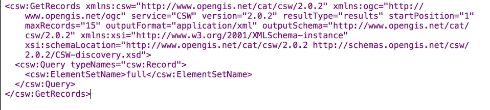

####Query records with a bounding box:

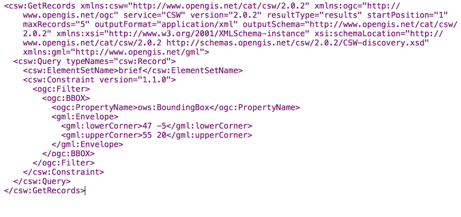

####Query records by attribute:

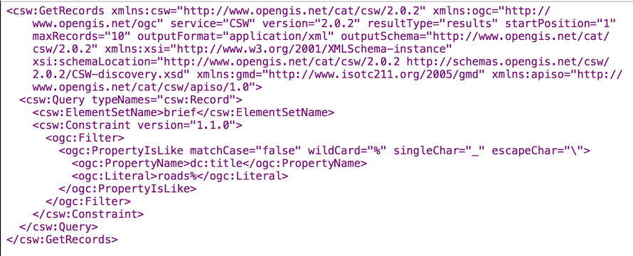

####Query records by full text search:

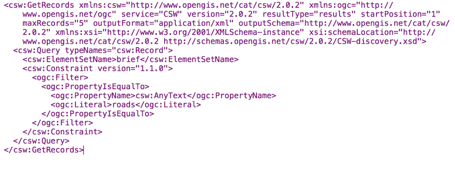

####and part of the response:

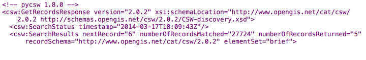

####Query records by combined bounding box and full text search:

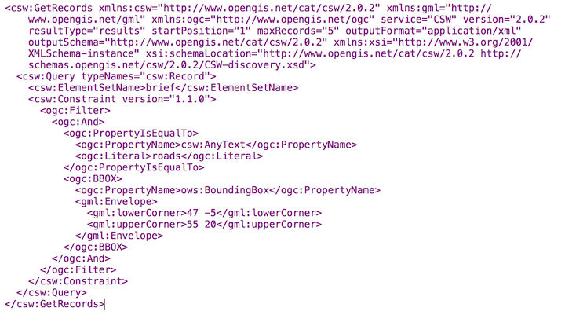

####Query the total number of records in the catalogue (HTTP GET):

http://exchange-dev.boundlessps.com/registry/search/csw?service=CSW&version=2.0.2&request=GetRecords&typenames=csw:Record&elementsetname=brief

###GetRecordById

The GetRecordById operation returns defailed information for specific metadata records.

__Examples:__

__HTTP GET:__

http://exchange-dev.boundlessps.com/registry/search/csw?service=CSW&version=2.0.2&request=GetRecordById&id=16bbf4f8-8e88-45c6-a76b-6af51b2b3555&elementsetname=full

__HTTP GET (ISO 19139):__

http://exchange-dev.boundlessps.com/registry/search/csw?service=CSW&version=2.0.2&request=GetRecordById&id=16bbf4f8-8e88-45c6-a76b-6af51b2b3555&elementsetname=full&outputSchema=http://www.isotc211.org/2005/gmd

__HTTP GET (ISO 19139 brief):__

http://exchange-dev.boundlessps.com/registry/search/csw?service=CSW&version=2.0.2&request=GetRecordById&id=16bbf4f8-8e88-45c6-a76b-6af51b2b3555&elementsetname=brief&outputSchema=http://www.isotc211.org/2005/gmd

__HTTP POST (XML):__

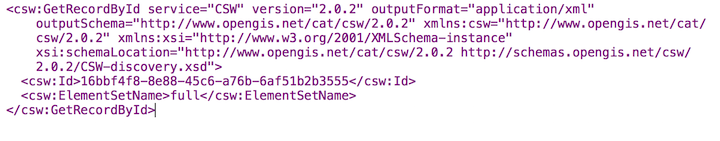

###Searching Collections

The Registry CSW supports searches within for collections. The following query searches for all records that are part of a collection via the __apiso:ParentIdentifier__ core queryable:

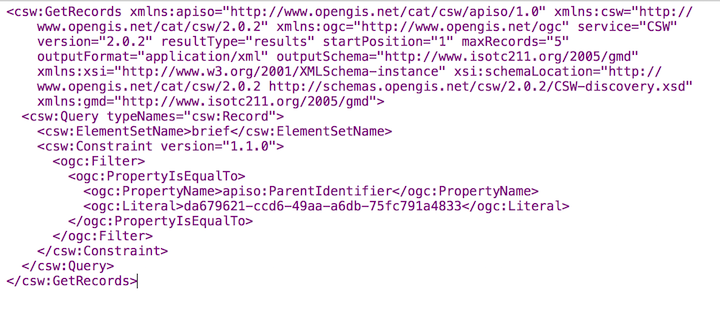

###OpenSearch Geo and Time Extensions

The Registry CSW endpoints support the OGC OpenSearch Geo and Time Extensions 1.0 standard. This provides a lightweight mechanism to query the catalogue via HTTP GET for simple spatial and temporal searches.

To query the Registry via OpenSearch, requests must be specificed with mode=opensearch. The following parameters are supported:

- __{searchTerms}__ (keywords)
- __{geo:box}__ (bounding box of minx,miny,maxx,maxy)
- __{time:start}__ and __{time:end}__ (temporal)

Specifying combinations of these parameters constitutes an exclusive search.

__Examples:__

__Autodiscovery:__

http://exchange-dev.boundlessps.com/registry/search/csw?mode=opensearch&service=CSW&version=2.0.2&request=GetCapabilities

__Keywords:__

http://exchange-dev.boundlessps.com/registry/search/csw?mode=opensearch&service=CSW&version=2.0.2&request=GetRecords&elementsetname=full&resulttype=results&typenames=csw:Record&q=idaho

__Bounding Box:__

http://exchange-dev.boundlessps.com/registry/search/csw?mode=opensearch&service=CSW&version=2.0.2&request=GetRecords&elementsetname=full&resulttype=results&typenames=csw:Record&bbox=-140,20,-40,40

__Temporal Extent (range):__

http://exchange-dev.boundlessps.com/registry/search/csw?mode=opensearch&service=CSW&version=2.0.2&request=GetRecords&elementsetname=full&resulttype=results&typenames=csw:Record&time=2001/2004

__Temporal Extent (since 2004):__

http://exchange-dev.boundlessps.com/registry/search/csw?mode=opensearch&service=CSW&version=2.0.2&request=GetRecords&elementsetname=full&resulttype=results&typenames=csw:Record&time=2004/

__Temporal Extent (before 2004):__

http://exchange-dev.boundlessps.com/registry/search/csw?mode=opensearch&service=CSW&version=2.0.2&request=GetRecords&elementsetname=full&resulttype=results&typenames=csw:Record&time=/2004

__Temporal Extent (2001/2007) and Keywords:__

http://exchange-dev.boundlessps.com/registry/search/csw?mode=opensearch&service=CSW&version=2.0.2&request=GetRecords&elementsetname=full&resulttype=results&typenames=csw:Record&time=2001/2007&q=fauna

__Temporal Extent (2001/2007) and Bounding Box:__

http://exchange-dev.boundlessps.com/registry/search/csw?mode=opensearch&service=CSW&version=2.0.2&request=GetRecords&elementsetname=full&resulttype=results&typenames=csw:Record&time=2001/2007&bbox=-140,20,-40,40

__Keywords and Bounding Box:__

http://exchange-dev.boundlessps.com/registry/search/csw?mode=opensearch&service=CSW&version=2.0.2&request=GetRecords&elementsetname=full&resulttype=results&typenames=csw:Record&q=vegetation&bbox=-140,20,-40,40

###Transactions

Registry's CSW service, powered by pycsw, has the ability to process CSW Harvest and Transaction requests (CSW-T).

###Supported Resource types
For transactions and harvesting, pycsw supports the following metadata resource types by default:

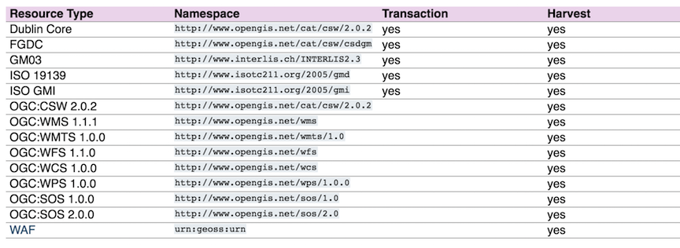

###Harvesting

__Note:__ Your server must be able to make outgoing HTTP requests for this functionality.

pycsw supports the CSW-T Harvest operation. Records which are harvested require to setup a cronjob to periodically refresh records in the local repository. A sample cronjob is available in _etc/harvest-all.cron_ which points to _pycsw-admin.py_ (you must specify the correct path to your configuration). Harvest operation results can be sent by email (via _mailto:_) or ftp (via _ftp://_) if the Harvest request specifies _csw:ResponseHandler_.

__Note:__ For _csw:ResponseHandler_ values using the mailto: protocol, you must have server.smtp_host set in your configuration.
OGC Web Services

When harvesting OGC web services, requests can provide the base URL of the service as part of the Harvest request. pycsw will construct a _GetCapabilities_ request dynamically.

When harvesting other CSW servers, pycsw pages through the entire CSW in default increments of 10. This value can be modified via the _manager.csw_harvest_pagesize_ configuration option. It is strongly advised to use the _csw:ResponseHandler_ parameter for harvesting large CSW catalogues to prevent HTTP timeouts.

###Transaction Operations
pycsw supports 3 modes of the Transaction operation (Insert, Update, Delete):

- __Insert:__ full XML documents can be inserted as per CSW-T
- __Update:__ updates can be made as full record updates or record properties against a _csw:Constraint_
- __Delete:__ deletes can be made against a _csw:Constraint_

Transaction operation results can be sent by email (via _mailto:_) or ftp (via _ftp://_) if the Transaction request specifies _csw:ResponseHandler_.

The Tester contain CSW-T request examples.
