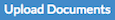
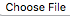
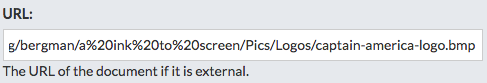
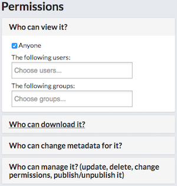
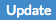

## Working with Documents
---
You can upload documents to Exchange so that they’re readily available for users. Documents can be actual files or links to other documents online. You can also associate a document to a layer or a map.

### Uploading Documents
---
Exchange lets you upload documents to associate to layers or maps.

To upload a document complete the following steps:

1. In the documents page, click on the  button.

    __Note:__ _Your Site Administrators may limit specific file types, typically the following file types are able to be uploaded._

    

2. Type in the Title for the Document that will appear in Exchange

3. Select the  button to browse to the file to upload or enter the URL for a web page or a document that’s online.

    

4. If you want to link the document to a map or a layer, choose it in the Link to section

    

5. Set permissions for who is able to view and manage the document accordingly

    

6. Click on the  button

7. The next page will allow you to enter metadata for the document. It’s good to enter the Abstract at a minimum.

8. When you have finished entering metadata click on the  button at the bottom of the page.

9. The document will now be listed as a possible result under the Documents page..
