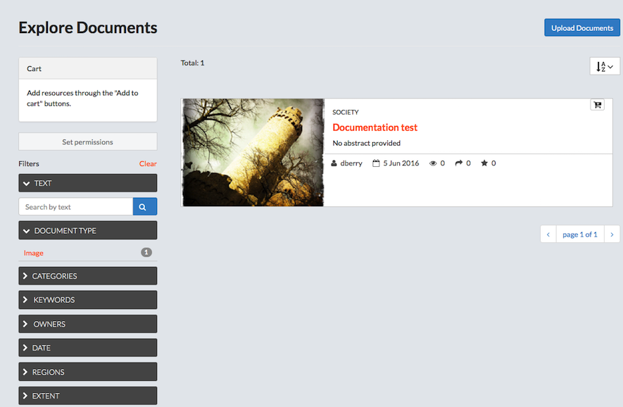
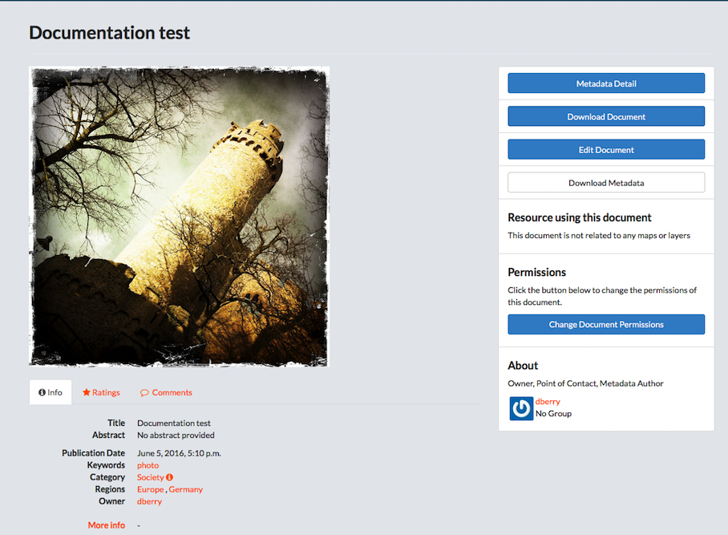
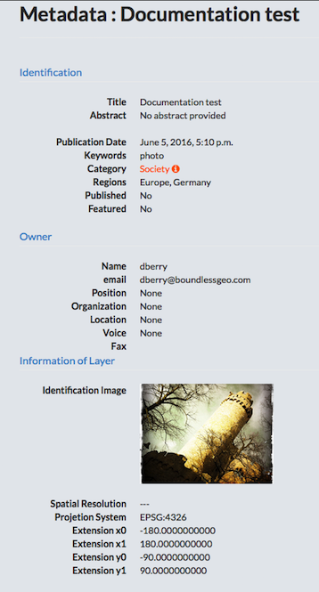

## Explore Documents

The Documents page allows you to search for supporting documentation published by others users and public sources. You are able to upload and download documents, as needed. The total number of available documents is displayed on this page.

### Filter for documents.
> Just as you are able to filter through the layers and maps to find something particular, you can also create a filtered search for
documents. The filters are searching through the metadata associated to the document.

* Click Documents on the main menu bar.
* Filter Documents.
    * Select a filter option to filter available documents.
        * Text.
            * Click the Text arrow.
            * Type a filter term in the Search by text textbox.
            * Press Enter.
        * Document Type.
        * Categories.
        * Keywords.
        * Owners.
        * Date.
        * Regions.
        * Extent.
        > Panning and changing the extent will limit the visible layers to only those within the displayed extent.

    * Click Clear to remove all filters.
* Click the AZ menu button to organize documents by Most Recent (default), less recent, A-Z, Z-A, or Most Popular.
* Add a document to the cart.
    * Click the Add to Cart button.
    > The document will display in the cart. Click the X to remove it.

    * Set permissions for the selected document.
        * Click the Set permissions button.
        * Edit the permissions.
        * Click the Apply Changes button.

### Upload a document.

* Click the Upload Documents button.
* Provide a title for the document.
* Click the Browse button to navigate to a file.
> Supported document types are: .doc, .docx, .gif, .jpg, .jpeg, .ods, .odt, .pdf, .png, .ppt, .pptx, .rar, .sld, .tif, .tiff, .txt, .xls, .xlsx, .xml, .zip, and .gz.

* Add the URL if the document is external.
* Select the Link to menu to link the uploaded document to an existing layer, map, or document.
* Add permissions for the document.
> The document permissions can be set to establish:

    * Who can view it?
    * Who can download it?
    * Who can change metadata for it?
    * Who can edit data for this layer?
    * Who can edit styles for this layer?
    * Who can manage it? (updated, delete, change permissions, publish/edit)
        * Give permissions to users.
        * Give permissions to groups.
* Click the Upload button.
* Edit the Metadata.
> Edit the details for the file to be uploaded.

    * Verify the Title is correct.
    * Edit the date.
    * Edit the data type.
    > This will identify when the given event occurred.

    * Add an edition/version of the cited source.
    * Add an abstract.
    > This is a brief summary of the content of the resources.

    * Add a purpose.
    > The purpose is a summary explaining why the resource was developed.

    * Select the Maintenance frequency.
    > The frequency with which modifications and deletions are made to the data after it is first produced.

    * Select a region(s) pertaining to the document(s).
    > Multiple regions can be selected for a single document.

    * Add document restrictions.
    > Select limitations based on the access or use of the data.

    * Add additional restrictions.
    > Add other restrictions and legal prerequisites for accessing or using the resource or metadata.

    * Select required licensing data for the dataset.
    * Select a language.
    * Select the Spatial representation type.
    > This is the method used to represent geographic information in the dataset.

    * Select the starting temporal extent date.
    * Select the ending temporal extent date.
    * Add any supplemental information.
    * Add any data to support the data producer’s knowledge of the lineage of the dataset.
    * Click the checkbox to select Metadata upload preserve.
    * Click the checkbox to make this featured on the homepage.
    * Click the checkbox to show this is published.
    * Add a thumbnail URL for the document.
    * Add any keywords to provide additional search options.
    * Verify the point of contact.
    * Verify the metadata author.
    * Select a layer or map to link to the dataset.
    * Select a category into which the document can be added.
    * Click the Update button.
* Verify the document displays.

### Preview a document

A brief description of the document is provided on the Explore Documents page. You can access additional data by clicking the title of the document.

* Click the title of the document to be viewed.

> The document will display on a new page, and will show all associated metadata. From here, user’s are able to download the document, edit the Metadata details, edit the document, change document permissions, see if the document is related to any maps or layers, share ratings, as well as provide feedback on the layer itself. Information on the owner, point of contact, and metadata author are also available from this screen.

* View/modify information associated to the document.
> The links below the document preview allow a user to view or modify data, comments and ratings associated to the document.

    * Click the Info link below the document for a quick view of the document’s information.
    * Click the Ratings link.
        * Click a star icon to Rate this document.
        * View the Average Rating for this document.
    * Click the Comments link.
        * Add a comment.
            * Click the Add Comment button.
            * Provide feedback in the Comment text box.
            * Click the Submit Comment button.
        * Click the Delete button to delete a user’s comment.
* View Metadata.
    * Click the Metadata Detail button.
    > All of the available metadata will be displayed on this page.

    

    * Click the Return to Document button to exit.
* Download a document.
    * Click the Download Document button.
    * Select the open or save radio button.
* Edit a document.
    * Click the Edit Document button.
    * Select what needs to be edited.
        * Click the edit button under Metadata to edit the metadata.
        * Click the Replace button under Document to replace this with another document.
            * Browse to a new document
            * Click the Replace Document button.
            * Click the Explore Documents button to exit.
            > This will take the user back to the Explore Documents. To go back to the document, click on the title.

        * Click the Remove button to delete the document.
* Download Metadata.
    * Click the Download Metadata button.
    * Select a download format.
* Change the permissions set for the document.
    * Click the Change Document permissions button.
    * Add or remove users from the desired category.
    > You can change who can view the document, who has permission to download, who can edit the metadata, and who can be a manager.

    * Click the Apply changes button.
