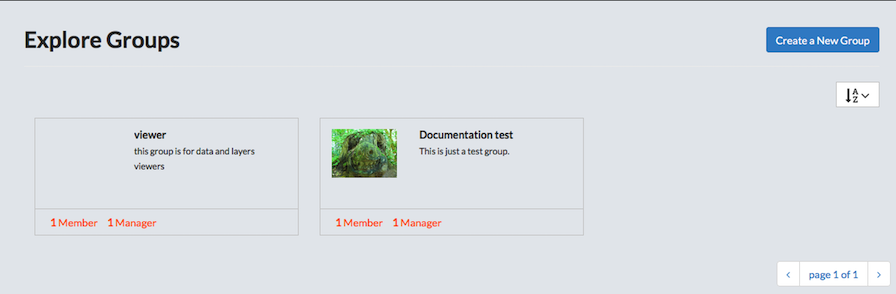
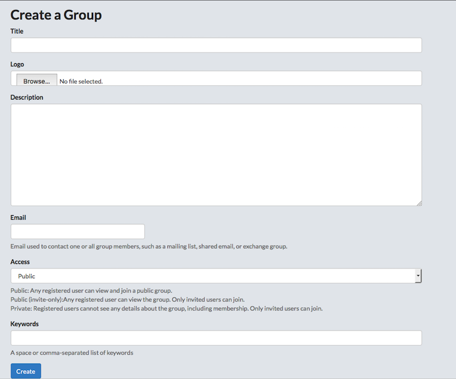

## Explore Groups

Groups allow you to share information within a selection of Exchange users. They can be organized by company, office, organization, or by whatever will meet the group’s needs. Groups can be created, edited, and deleted from the Explore Groups page.

### Create a new group

* Click Groups on the main menu bar.
> From here, you can see all available groups, the number of members, and the number of managers. Information pertaining to the group’s purpose may also be available.

* Click the Create a New Group button.
* Create a Group.

    

    * Provide a Group title.
    * Browse to a group logo (optional).
    * Provide a description of the group.
    > This description can include the purpose of the group, what types of data will be shared, or any descriptive information that will allow others to know what this group does.

    * Provide an email address.
    > This will be used to contact one or all group members, such as a mailing list, shared email or exchange group.

    * Select who will have access to this group.
        * Public: Any registered user can view and join.
        * Public (invite only): Any registered user can view the group. Only invited users can join.
        * Private: Registered users cannot see any details about the group, including membership. Only invited users can join.
    * Add keywords.
    > Keywords will assist you in searching for a group based on associated words. The keywords can be separated by a space or comma.

    * Click the Create Group button.
    > The group information page will open. All member and manager data will be available here. Managing group data can be done from this page, as well.

    * Manage group settings.
        * Click Edit Group Details.
            * Update any necessary information.
            * Click the Update button.
        * Click Manage Group Members.
            * Click the remove button next to a user to remove them from the group.
            * Select the role for the new member.
                * Manager.
                * Member.
            * Choose users in the User identifiers box.
            > Predictive text allows you to find other users more quickly.

            * Click the Add Group Member button.
        * Click Delete this group to delete from the system.
        > You will be asked to verify your decision before the group is removed.

        * Click Group Activities.
        > Group Activity Feed will display any actions taken by the group; layer or maps added, or any comments that have been made.
