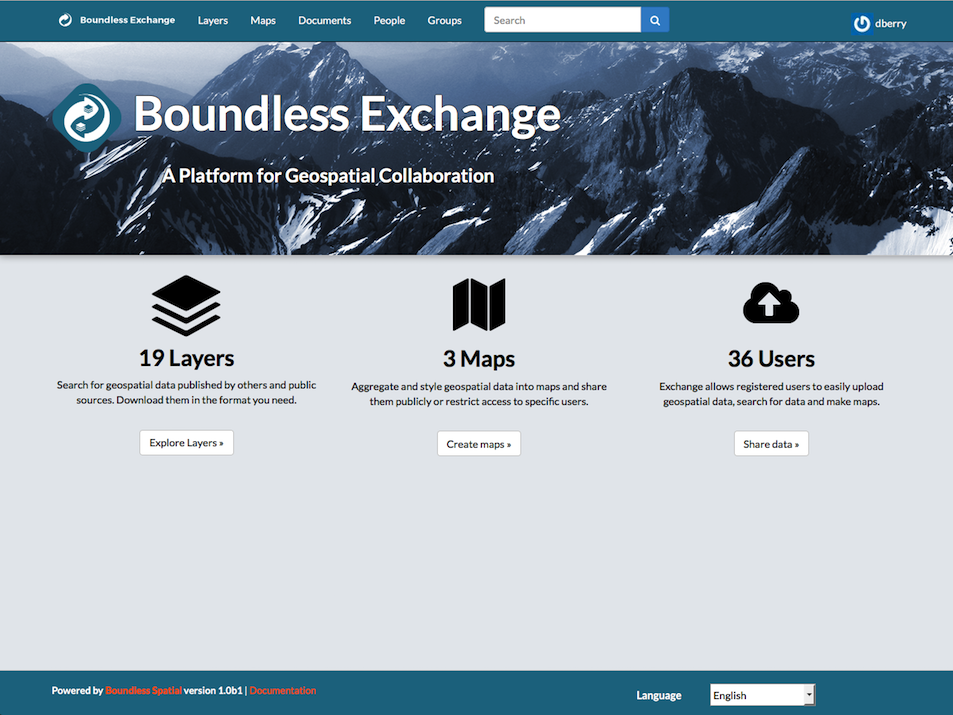

hide_toc: true

## Exchange Landing Page

Once logged into Boundless Exchange, you are presented with the landing page, containing an overview of the system contents. From this page, you can access the User Menu to view and edit your account settings. The landing page also provides easy navigation to your __Layers__, __Maps__, and __Documents__, as well as __People__ and __Groups__. The search bar allows you to quickly search the Exchange for particular content.

