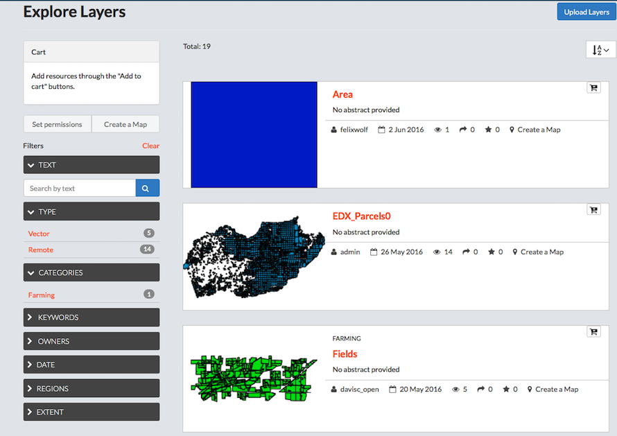
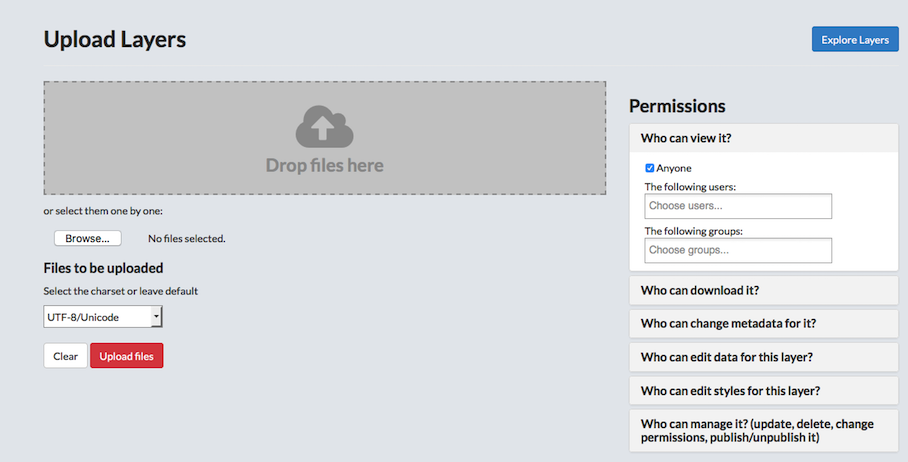
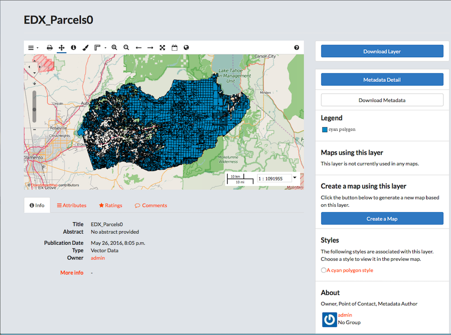
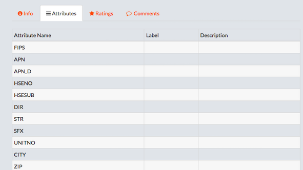
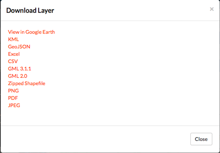
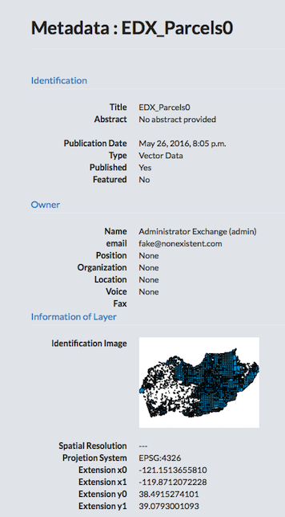
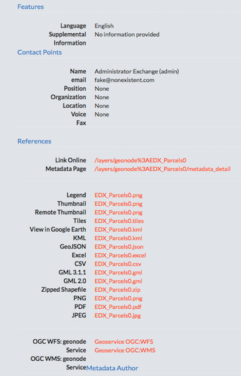
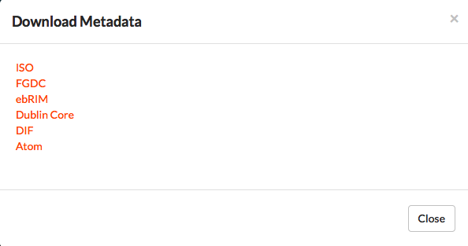
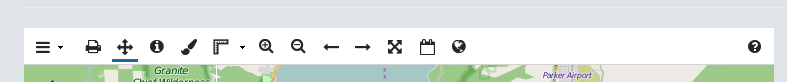
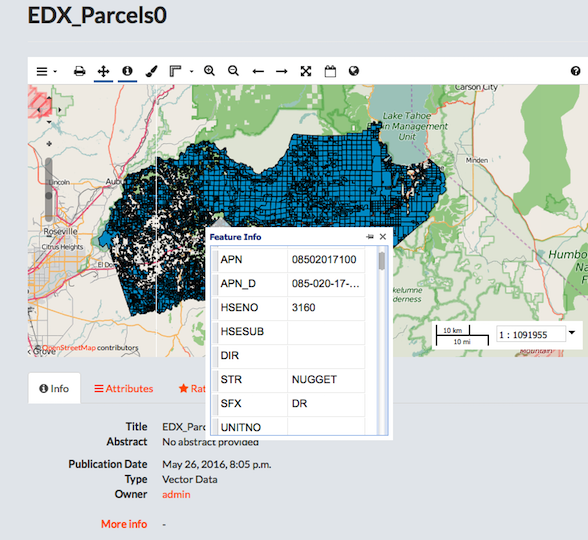

## Explore Layers

The Layers page allows you to search for geospatial data published by others users and public sources. You are able to download them in the format you need; all data can be downloaded in a variety of formats for use in other applications. The number of available layers is displayed near the top of the page.

### Filter for layers.

* Click the __Explore Layers__ button.
* Filter Layers.
    * Select a filter option to filter available layers.
    > Filters are based on the metadata provided for the layer.

        * Text.
            * Click the __Text__ arrow.
            * Type a filter term in the __Search by text__ textbox.
            * Press Enter.
        * Type.
        > Select Vector or Remote to filter results by type.

        * Categories.
        > Select a term in the list to filter by category.

        * Keywords.
        > Select a keyword in the list to filter by keyword.

        * Owners.
        > Select an owner in the list to filter by the owner of the layer.

        * Date.
        > Filter the layers by date.

        * Regions.
        * Extent.
        > Panning and changing the extent will limit the visible layers to only those within the displayed extent.

    * Click Clear to remove all filters.
* Click the AZ menu button to organize layers by Most Recent (default), less recent, A-Z, Z-A, or Most Popular.
* Add a layer to the cart.
    * Click the __Add to Cart__ button.
    > The layer will display in the cart. Click the __X__ to remove it.

    * Set permissions for the selected layers.
        * Click the __Set permissions__ button.
        * Edit the permissions.
        * Click the __Apply Changes__ button.
    * Click the __Create Map__ button to add the layers to a map.

### Upload a layer.

* Click the __Upload Layers button__ in the upper right corner of the Explore Layers page.
* Add files to the system.
    * Click and Drag multiple files to the Drop files here box.
    * Browse to files to add one at a time.
    > The system will automatically detect the file type, and present the user with two options: configuring time or importing into GeoGig.

    * Select the chartset from the menu.
* Set user and group permissions for the layer.
> The layer permissions can be set to establish:

        * Who can view it?
        * Who can download it?
        * Who can change metadata for it?
        * Who can edit data for this layer?
        * Who can edit styles for this layer?
        * Who can manage it? (updated, delete, change permissions, publish/edit)
            * Give permissions to users.
            * Give permissions to groups.

* Click the __Upload__ button.
* Click the __Explore Layers__ button to verify the layer was added successfully.

### Preview a layer.

* Click the title of the layer to be viewed.  
> A new page displays, showing the layer on a map and all associated metadata. Here, you can download the layer, edit the Metadata details, generate a map from the layer, view associated styles, share ratings, as well as provide feedback on the layer itself. Information on the owner, point of contact, and metadata author are also available from this screen.

* View/modify information associated to the layer.
> The links below the layer preview allow a user to view or modify data, comments and ratings associated to the layer.

    * Click the Info link below the layer for a quick view of the layer’s information.
    * Click the Attributes link to view attribute data.

    
    > Attribute data for the layer will display.

* Click the Ratings link.
    * Click a star icon to Rate this layer.
    * View the Average Rating for this layer.
* Click the Comments link.
    * Add a comment.
        * Click the Add Comment button.
        * Provide feedback in the Comment text box.
        * Click the Submit Comment button.
    * Click the Delete button to delete a user’s comment.
* Download a layer.
    * Click the Download Layer button.
    * Select a download format.

    
    > The variety of options allows a user to download the layer for use in multiple programs.

* View Metadata.
    * Click the Metadata Detail button.

    
    > All of the available metadata will be displayed on this page.

    * Click the __Return to Layer__ button to exit.
* Download Metadata.
    * Click the __Download Metadata__ button.
    * Select a download format.

    

* Create a map using this layer.
    * Click the __Create a Map__ button.
    * Verify the layer displays on a new map.
* Click a style radio button to view in the preview map.
> The available styles are associated to the layer. Select styles to view them on the layer.

* Edit the preview layer.

    

    * Toggle layers off and on.
        * Click __Layer Switcher__ on the layer toolbar.
        * Click a layer in the list to view/remove from the preview.
    * Print the layer.
        * Click __Print map__ on the toolbar.
        * Edit print information.
        * Recenter/zoom to desired view.
        * Click the __print__ button.
    * Pan the map.
        * Click __Pan map__ on the toolbar.
        * Click and drag map to desired location.
    * Identify a feature.
        * Click __Get Feature__ info on the toolbar.
        * Click a feature on the map.

        
        > Attribute data for the feature will display.

        * Click additional features for more information.
    * Modify layer styles.
        * Click Layer Styles on the toolbar.
        * Add additional styles/rules.
        * Edit existing styles/rules.
        * Duplicate an existing style/rule.
    * Measure tool.
    > Measurements will be provided in both kilometers and miles.

        * Click Measure on the toolbar.
        * Select Length or Area.
        * Click and drag points on the layer to measure.
        * Double-click to stop.
        > Click the Measure tool on the toolbar to turn the measure feature off.

    * Zoom in/Zoom out features.
    * Zoom to Previous/Next extent.
    * Zoom to Max extent.
    > This will take you to the world extent on the map.

    * Show legend.
    > Click to show the layer’s legend information.

    * Switch to 3D/Map view.
    > This option toggles between the standard map view, and a 3D view using the Google Earth Plugin. Any map viewed in the interactive map editor can be seen in 3D mode with the Google Earth plugin. To switch to 3D mode select the Google Earth globe logo, the rightmost button on top toolbar. If you do not have the Google Earth plugin installed you will be prompted to install it.
