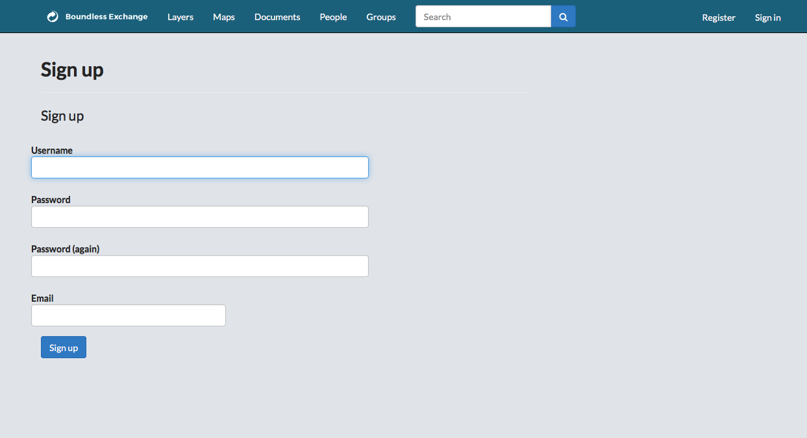
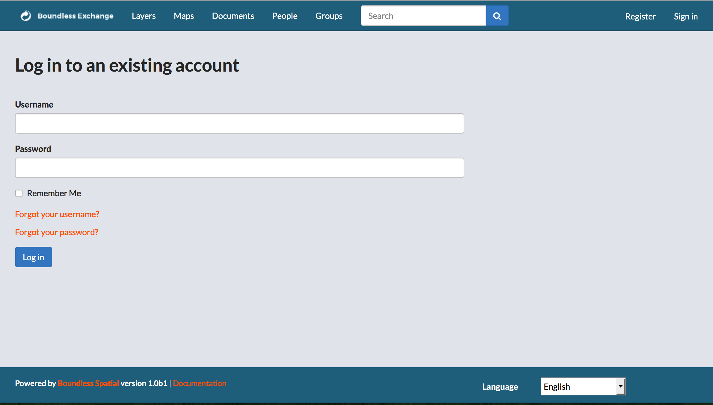

## Log in to Boundless Exchange

Before using Boundless Exchnage, you must register for an account.

### Register for a New Account

* Click __Register__ in the upper right corner.
* Type a user name in the __Username__ text box.
* Type a password in the __Password__ text box.
* Re-type the password in the Password (again) text box.
* Type an email address in the __Email__ text box.
* Click the __Sign up__ button to sign up for a Boundless Exchange account.

### Log in to an Existing Account

* Click __Sign In__ in the upper right corner.
* Type your user name in the __Username__ text box.
* Type your password in the __Password__ text box.
* Click the __Remember Me__ checkbox (optional).
* Click the __Log in__ button to login to Boundless Exchange.
