## Explore Maps

Boundless Exchange allows you to share and create maps from layers and existing maps. From the Explore Maps page, you can perform similar tasks as you did in Explore Layers.

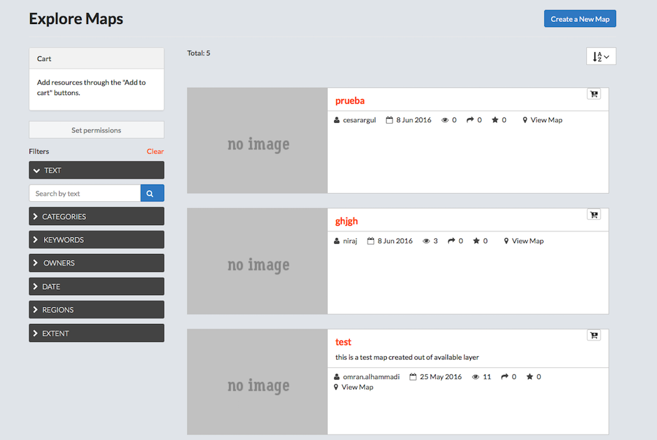

### Filter for maps
Filtering for maps works the same as the filter option for layers. The filters are using the metadata associated to each map.

* Click Maps on the main menu bar.
* Filter Maps.
    * Select a filter option to filter available maps.
        * Text.
            * Click the __Text__ arrow.
            * Type a filter term in the __Search by text__ textbox.
            * Press Enter.
        * Categories.
        > Select a term in the list to filter by category.

        * Keywords.
        > Select a keyword in the list to filter by keyword.

        * Owners.
        > Select an owner in the list to filter by the owner of the map.

        * Date.
        > Filter the maps by date.

        * Regions.
        * Extent.
        > Panning and changing the extent will limit the visible layers to only those within the displayed extent.

    * Click __Clear__ to remove all filters.
* Click the AZ menu button to organize maps by Most Recent (default), less recent, A-Z, Z-A, or Most Popular.
* Add a map to the cart.
    * Click the __Add to Cart__ button.
    > The layer will display in the cart. Click the X to remove it.

    * Set permissions for the selected maps.
        * Click the Set permissions button.
        * Edit the permissions.
        * Click the __Apply Changes__ button.
    * Click the __Create Map__ button to open a new map.

### Preview a map
* Click the title of the map to be viewed.  
> A new page displays, showing the map and all associated metadata. Here, you can download the map, edit the metadata details, view the map, view associated layers, share ratings, as well as provide feedback on the layer itself. Information on the owner, point of contact, and metadata author are also available from this screen.

* View/modify information associated to the map.
> The links below the map preview allow a user to view or modify data, comments and ratings associated to the layer.

    * Click the Info link below the map for a quick view of the map’s information.
    * Click the Ratings link.
        * Click a star icon to Rate this map.
        * View the Average Rating for this map.
    * Click the Comments link.
        * Add a comment.
            * Click the __Add Comment__ button.
            * Provide feedback in the Comment text box.
            * Click the __Submit Comment__ button.
        * Click the __Delete__ button to delete a user’s comment.
* Edit the preview map.
    * Toggle layers off and on.
        * Click __Layer Switcher__ on the layer toolbar.
        * Click a layer in the list to view/remove from the preview.
    * Print the map.
        * Click __Print__ map on the toolbar.
        * Edit print information.
        * Recenter/zoom to desired view.
        * Click the __print__ button.
    * Pan the map.
        * Click __Pan map__ on the toolbar.
        * Click and drag map to desired location.
    * Identify a feature.
        * Click __Get Feature__ info on the toolbar.
        * Click a feature on the map
        > Information about the attribute will display.

    * Modify layer styles.
        * Click __Layer Styles__ on the toolbar.
        * Add additional styles/rules.
        * Edit existing styles/rules.
        * Duplicate an existing style/rule.
    * Measure tool.
    > Measurements will be provided in both kilometers and miles.

        * Click __Measure__ on the toolbar.
        * Select Length or Area.
        * Click and drag points on the layer to measure.
        * Double-click to stop.
        > Click the Measure tool on the toolbar to turn the measure feature off.

    * Zoom in/Zoom out features.
    * Zoom to Previous/Next extent.
    * Zoom to Max extent.
    > This will take you to the world extent on the map.

    * Show legend.
    > Click to show the legend information.

    * Switch to 3D/Map view.
    > This option toggles between the standard map view, and a 3D view using the Google Earth Plugin.

    * Click the Information button for map details.

    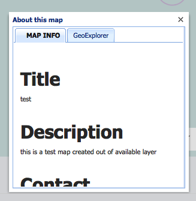
    > Information about the map will display.

* Download a map.
    * Click the __Download map__ button.
    * Select a download format.
        * Click __Download Data Layers__.
        > Here you can download all of the layers of this map that are hosted on the GeoNode. A warning will display if the map contains layers that cannot be downloaded because they are not available directly from the GeoNode.

        * Click Download Web Map Context.
* View Metadata.
    * Click the Metadata Detail button.
    > All of the available metadata will be displayed on this page.

    * Click the back button to return to the map preview.
* Edit the Map.
    * Click the __Edit Map__ button.
    * Select an option to edit the Metadata, Thumbnail or Map.
    * Click the __Close__ button.

    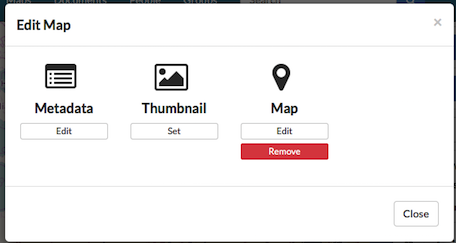

* Click the View Map button to open a new map.
> The layers displayed on the map are listed under Map Layers.

* Set Map Permissions.
    * Click the Change Permissions button.
    * Edit the permissions for users.
    * Click the Apply Changes button.
* Create a map.
    * Click the Create a New Map button.
    * Verify the layer displays on a new map.
* Click Publish Map WMS (optional).
> Publish the local map layers as a WMS layers group.

### Create a map
The Create a New Map button is available in both the layers and map sections, as well as from your profile page. You can select the option to create a map when you have added a layer or map to your cart, or you can create one from the preview page.

* Log in to Map Composer using Boundless Exchange credentials.

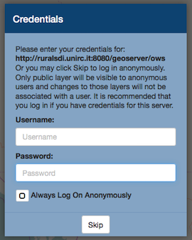
> You are given the option to log in with their username and password, or to log on anonymously. If a username and password are not used, you will only be able to view public layers, and any changes will not be associated to a username.

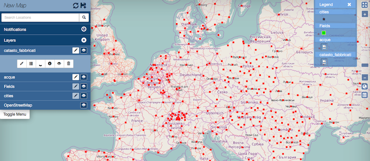

* Configure the map settings.
> When the map opens, the Map Menu is in the upper left corner. The Legend and zoom features are in the upper right corner. The lower left corner will display the scale in the standard and metric systems. You can also click the Switch Coordinate Display button to change the coordinate system from MGRS, DMS or XY.

* Map Menu.
    * Click the Refresh Layers icon to refresh the map.
    * Click the Toggle Menu button to hide and unhide the menu.
    * Notifications.
    * Layers.
    > The map uses OSM basemap, and all layers added to the map in previous steps will display in the menu.

        * Click the Toggle Visibility button next to a layer to turn it off and on.
        * Add a feature to a layer.
            * Click the Add Feature button next to the layer.
            * Click the Add new polygon geometry to MultiPolygon button.

            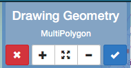

            * Click on the map to add points.
            * Click the starting point to close the polygon.
            * Click the Right Angles button to create precise right angles on a rectangle.
            * Click the Remove selected polygon from MultiPolygon to remove the polygon from the screen.
            * Click the Accept Feature to add the new feature to the layer.
            * Add the feature attributes.
            > When accepting features to a MultiPolygon, the Edit Attributes dialog box will open. You will need to add the required attributes (FTR-Code, Description, Subtype, Impervious, Dates, and Shape names) to the layer, then click the save button.

            * Click the Cancel feature to exit the drawing geometry.
        * Click and drag a layer in the menu to position them in the preferred order.
        * Layer toolbar.
            * Click a layer to open the toolbar.
            > Hover over each button to identify what it does.

            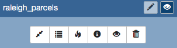

            * Zoom to Layer – Zoom in or out to show the layer.
            * Show Table – Displays the attribute table of the layer.

                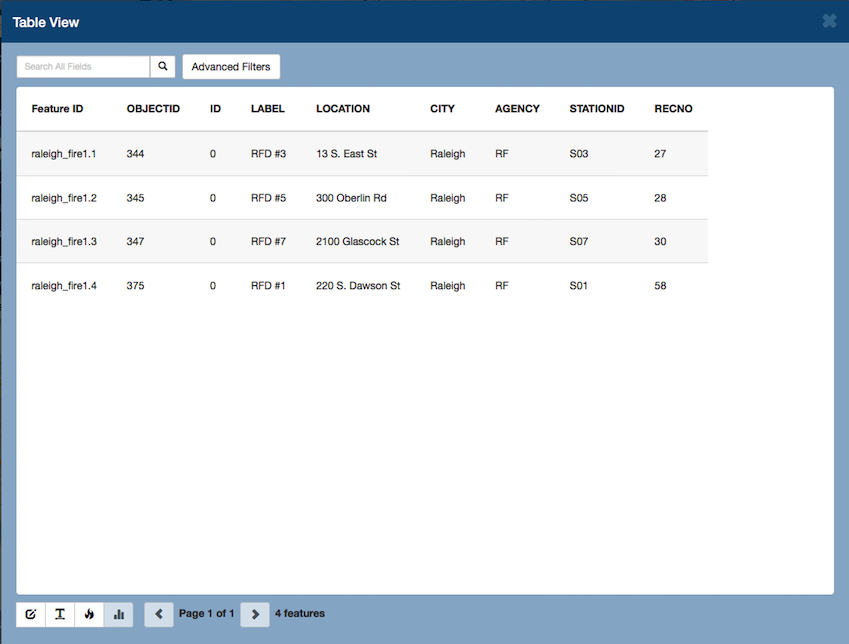
                > The table view allows you to search for attributes, and make edits to the table using the toolbar located at the bottom of the screen.

                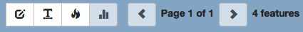

                * Add a search term to the search text box to find a specific attribute.
                * Advanced Filters allow you to search for an exact match of terms or search for a range.
                * Edit Attributes allows you to edit the individual attributes of a table. All changes can be saved.
                * Toggle Word Wrap turns wrap text off and on.
                * Show Heatmap.

            * Show Heat Map.
            * Show Layer Info displays layer metadata.

            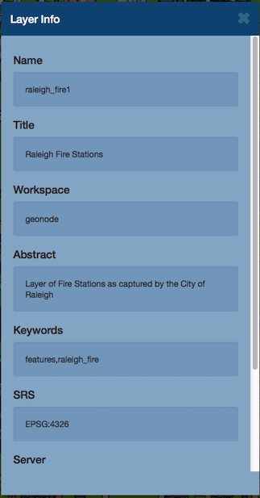

            * Show Attribute Visibility turns attributes off and on in the
            * Remove Layer will remove the layer from the map.
        * Save the map.
        > Once the map is configured to your specific needs, you can save your map.

            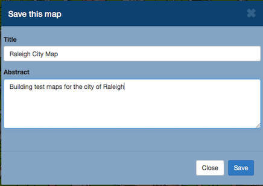

            * Click the Save this map icon.
            * Type a title in the title text box.
            * Type a brief description of the map and its contents in the Abstract text box.
            * Click the Save button.
            > The name of the map will now be displayed, having replaced New Map.
