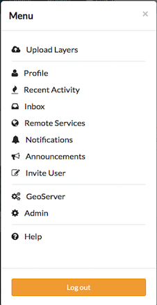
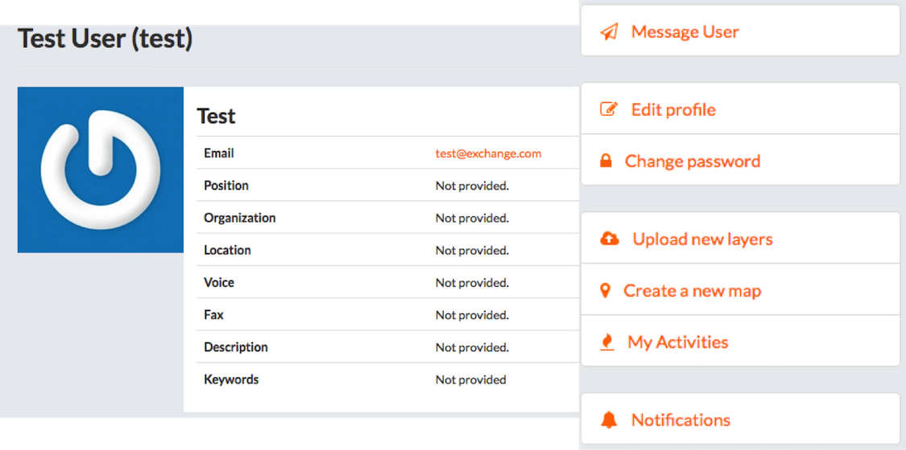
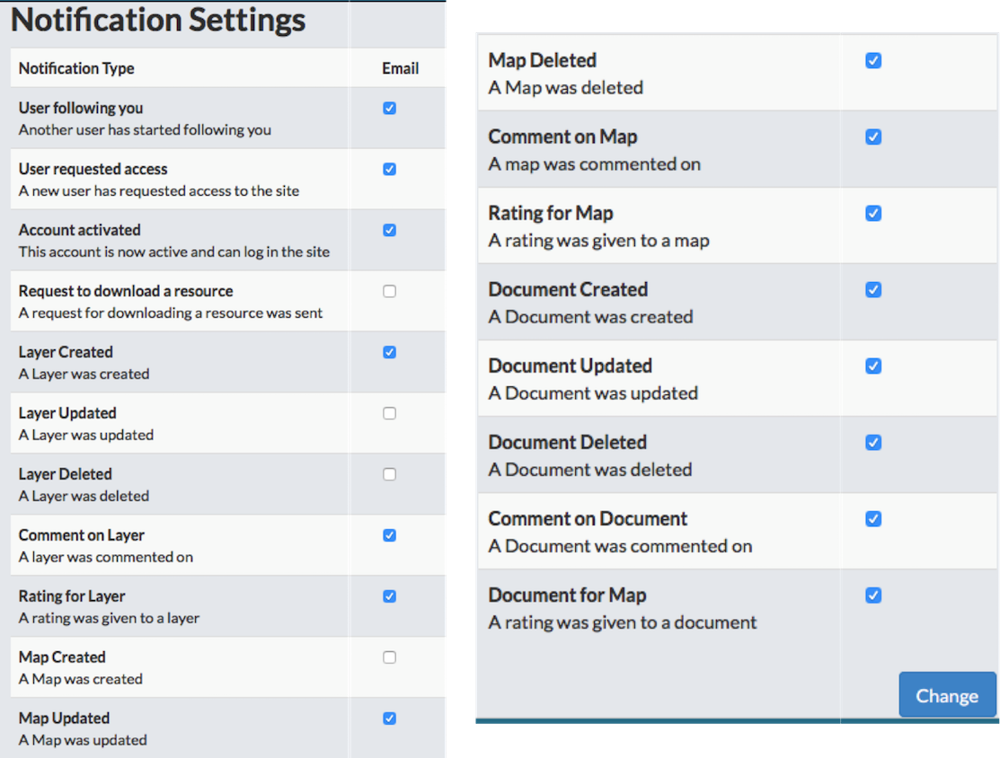
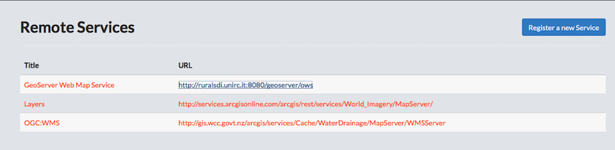

## User Menu

### Access User account settings.

Click your username in the upper right corner of the page and select a Menu Option.

### Upload Layers
> You are able to upload layers from multiple points throughout Boundless Exchange. More detailed instructions are provided in the Explore Layers section.

* For multiple layers, click and drag layers into the __Drop Files Here__ box.
* For individual layers, click the __Browse__ button, and navigate to the layer to be unloaded.
* Select the charset in the drop down menu. (The default chartset is UTF-8/Unicode.)
* Edit the permissions for this layer.
    * Click a permissions hyperlink for who can access the files.
    * Check the __Anyone__ checkbox to edit permissions.
    * Type a user or a group in the text box to give permissions to only that user or group.
* Click the __Upload files__ button.

### Profile
> Clicking __Profile__ on the __User Menu__ will open your profile, displaying any information you have provided. This is how other users will see your profile, as well. From here, you can make profile edits, as well as message other users, change your password, upload layers, create a map, view your activities and configure your notification settings. Several of these settings are also found under the User Menu.

* Send a message to another user. Message User works similarly to sending an email.
    * Click __Message User__.
    * Select a user in the To drop down menu.
    * Type a message subject in the __Subject__ text box.
    * Type the message content in the __Content__ box.
    * Click the __Send message__ button.
* Edit Profile.
> The First name, Last name and Email address fields must be filled out in this section for version history to work properly. All of the other fields are optional.

* Change Password.
    * Type a new password in the __New Password__ text box.
    * Type the same password in the __New Password (again)__ text box.
    * Click the __Change my password__ button to save changes.

* Upload new layers.
* Create a new map.
> Once again, Boundless Exchange offers multiple ways to add and create data. Creating a new map will be explained in detail in the Explore Maps section.

* My Activities.
> Displays your recent Activity Feed. Anything you have uploaded, created or deleted will be listed here.

* Notifications.
    * Check or uncheck a box to receive an email notifying a user of an event.
    > A list of notification types include a new user following you, a user requested access, an account is activated, a request to download a resource was sent, a layer, map or document was created, updated, deleted, rated or commented on.

    * Click the Change button.

### Recent Activity
> Displays the recent upload, create or delete activity of a user. These can be filtered by Layers, Maps or Comments by clicking the corresponding hyperlink.

### Inbox
> Displays messages sent/received by user.

### Remote Services
> Any remote service that is added must be in the same projection as the basemap. Contact your administrator to find out if it must be EPSG:900913 or EPSG:4326.

### Notification Settings
> These are also set when editing your user profile.

### Help
> The __Help__ section provides helpful information about how to use the GeoNode. You can use the sidebar links to navigate to specific sections. Content is available for __Browsing Layers, Developer Access, Browsing Maps, Creating a Map, Exporting a Map, and Remixing a Map__.

### Log Out
