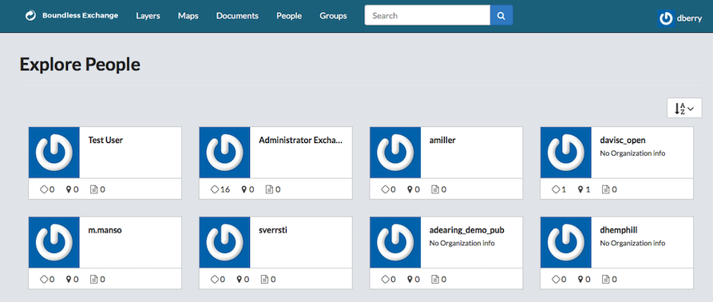
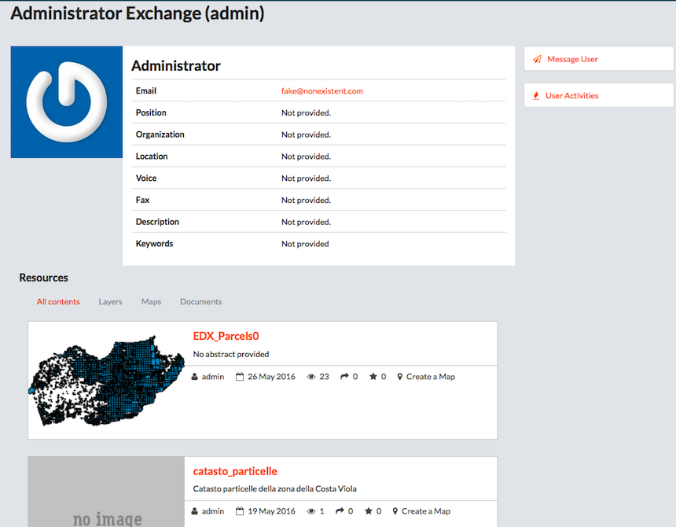

## Explore People

You can find information on other Boundless Exchange users through the Explore People page.

* Click People on the main menu bar.
* Click on a user name to get their details.
> The user’s information page will contain their name, email address, position, location, organization, voice, fax number, description or keywords, if they were provided. From here you will be able to send a message to the user, view their recent activity, and all of the recourses they have added to the system.

* Click Message User to send a message directly to the user.
* Click User Activities to view their activity feed.
> See what the user had added, removed, or uploaded in the past.

* Click any of the user’s contents to access a layer, map or document.
> Clicking Layers, Maps or Documents can filter the user’s Resources. The system default’s to display all contents.

