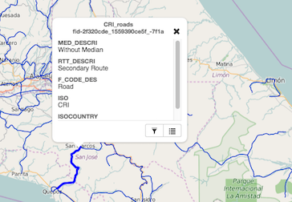
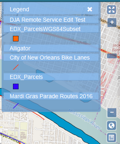
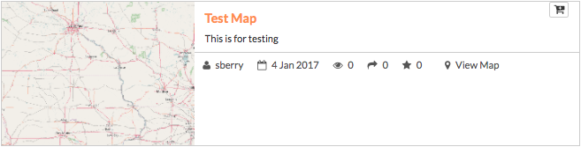
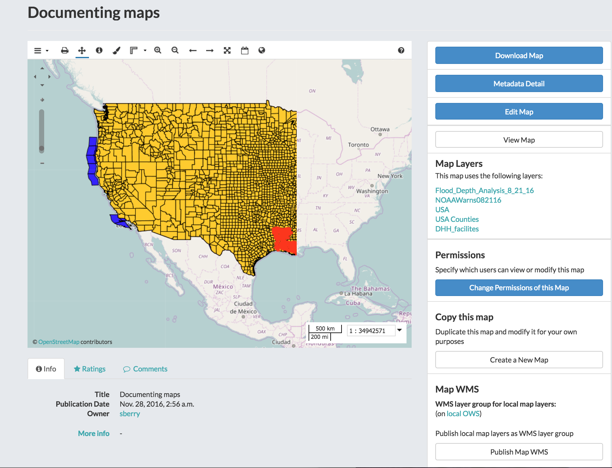

Working with Maps
=================

Maps are comprised of various layers and their styles. Layers are available as local layers, or they can be remote layers, served from other web servers. Exchange maps can be manipulated via map zoom and extent, layer ordering, and style.

Create a map
------------

Maps can be created in the Explore Maps section, or from one or more layers in Explore Maps.

Create a new map
^^^^^^^^^^^^^^^^

Select the **Maps** link on the Boundless Exchange toolbar at the top of the page.

.. figure:: img/bex-toolbar.png

Click the :guilabel:`Create a New Map` button. A new map environment will open.

Create a new map from a single layer
^^^^^^^^^^^^^^^^^^^^^^^^^^^^^^^^^^^^

#. Select the **Layers** link on the Boundless Exchange toolbar at the top of the page.

.. figure:: img/bex-toolbar.png

2. Select the **Create a Map** link under the layer you'd like to add to the map. A new map will open with the layer as part of the map.

Create a new map from multiple layers
^^^^^^^^^^^^^^^^^^^^^^^^^^^^^^^^^^^^^

#. Click the :guilabel:`Cart` icon next to the layers you'd like to add to your map. They will display in your cart until you are ready to build your map.

#. Click the :guilabel:`Create a map` button to add all of the layers to a new map.

   .. figure:: img/create-map-from-cart.png

   *Remove a layer from the cart by clicking the* :guilabel:`X` *next to its name.*

A new map will open with all of the layers displayed.

Add layers to a map
-------------------

Layers can also be added to the map from within the map environment using the Add Layer feature.

#. Click the Add Layer :guilabel:`(+)` button in the Layers field.

   .. figure:: img/maps-add-layers.png

The Add Layers dialog box will open. From here you can select which layer(s) you would like to add to the map by clicking the checkbox next to the layer’s name.

   .. figure:: img/maps-add-layers-dialog.png

2. Click the :guilabel:`Add` button when you have selected the layers you want to add.

Add layers from another server
^^^^^^^^^^^^^^^^^^^^^^^^^^^^^^

Layers can be added from a server other than your local Geoserver. You can add web mapping services (WMS), tile servers, MapQuest, MapBox and OpenStreetMap, for example.

#. Click the Add Layer :guilabel:`(+)` button in the Layers field.

#. Click the drop down menu to select a server. Select **Add New Server** to add one that is not listed.

#. Add the type of server (WMS or TMS), a name for the server and the URL in the Add Server dialog box.

   .. figure:: img/maps-add-server.png

#. Click the :guilabel:`Add` button to save it to the list of available servers. Once added, you can select the new server from the list, and add additional layers to the map.

Change layer order
^^^^^^^^^^^^^^^^^^

Layers on a map are drawn from bottom to top. The top layer in your list will display on top of any layers below it. Each layer will appear in the order it is displayed in your list. Sometimes a layer may need to be reordered so it can be more clearly displayed.

#. Click on the name of the layer you want to reorder.

#. Drag the layer up or down to the desired position.

Toggle layer visibility
^^^^^^^^^^^^^^^^^^^^^^^

Toggle Visibility allows you to turn a layer’s display off and on without having to remove the layer form the map completely.

.. figure:: img/toggle-layer-visibility.png

#. Click the Toggle Visibility button to turn a layer off.

#. Click the Toggle Visibility button again to turn a layer back on.

Zoom to data
^^^^^^^^^^^^

The Zoom to data button allows you to center the map quickly on a particular layer. It is particularly convenient when you need to quickly return to the extent of the data for that layer.

#. Click a layer in the layer list.

#. Click the :guilabel:`Zoom to data` button. The map will zoom in and center on that particular layer's extent.

   .. figure:: img/map-zoom-to-data.png

.. important:: If a layer’s visibility is dependent on scale, and the data extent is at a lower scale, you will need to zoom in to view the data.

Show layer info
^^^^^^^^^^^^^^^

Information about a layer is available in the map by clicking the Show Layer Info button. Show Layer Info will include server information, basic metadata, and the projection (SRS).

#. Click on a layer name in the layer list to expand the layer options.

#. Click the :guilabel:`Show Layer Info` button.

   .. figure:: img/show-layer-info.png

The Layer Info window will display.

   .. figure:: img/layer-info.png

Remove a layer from the map
^^^^^^^^^^^^^^^^^^^^^^^^^^^

#. To remove a layer from the map, click the name of the layer you’d like to remove, and click the :guilabel:`Remove layer` button in the layer tools.

   .. figure:: img/remove-a-layer.png

#. Click the :guilabel:`Yes` button to confirm.

   .. figure:: img/confirm-remove-layer.png

Get feature information
^^^^^^^^^^^^^^^^^^^^^^^

To get information in a vector layer, simply click a feature on the map. Once you click the feature, the information window will display. The point of the information window will touch the feature you clicked.

Change attribute visibility
^^^^^^^^^^^^^^^^^^^^^^^^^^^

Individual attribute visibility can be turned off and on in a feature window. This can make managing large numbers of attribute fields in a layer easier.

#. In the layers list on the map, select on the layer whose attribute visibility you'd like to change. The layer’s additional options will display.

   .. figure:: img/toggle-attribute-visibility.png

#. Click on the visibility button for an individual icon to toggle the visibility off and on.

#. Click a feature on the map from that layer. It will no longer appear, as it has been toggled off.

Using the legend
^^^^^^^^^^^^^^^^

A legend displayed the symbols used for vector layers in a map. It can be toggled off and on to maximize screen space when necessary.

Click the Toggle Legend button to toggle the legend off and on.

.. figure:: img/toggle-legend.png

Save a map
^^^^^^^^^^

Saving a map allows you to maintain your preferences for the next use, as well as makes it available for other Exchange users.

#. Click the Save this map button.

   .. figure:: img/save-map.png

#. Add a title and an abstract for your map so it is searchable by others. Click the Save button to save your changes. The name will be reflected in the title, and replace “New Map.”

   .. figure:: img/save-this-map.png

The Map is now saved in the list of maps on the Maps page.

Create a copy of a map
^^^^^^^^^^^^^^^^^^^^^^

You are able to use an existing map as a starting point for another map. This allows you to incorporate the work others have done without changing their maps.

#. Click **Maps** on the Boundless Exchange toolbar, and select on the map you would like to copy. This will open the map details page.

#. Click the :guilabel:`Create a New Map` button under the Copy this map section.

   .. figure:: img/copy-this-map.png

A new map will open, populated with all of the layers of the map you copied.

#. Click the :guilabel:`Save this map` button on the toolbar.

    .. figure:: img/save-map.png

#. Add a new title and an abstract, possibly indicating this is a copy of another map.

#. Click the :guilabel:`Save Copy` button.

Your new map is now saved, and can be accessed from the maps page.

.. important:: You are only copying the map. Any changes you make to the layer (data set) will affect both maps. Copying the map would primarily be used to make visual changes.

Managing Maps
-------------

Every map has its own details page, which provides more information about the map, the metadata and who has what permissions for making edits. To get to the details page for a map, click on the map title.

The map details page provides a view of the map, along with information about the map. It also tells you which layers are used in the map.

Download data layers
^^^^^^^^^^^^^^^^^^^^

Here you can download the contents of a map that is stored in Exchange. It does not download data from other servers, however.

#. Click the :guilabel:`Download Map` button.

#. Select **Download Data Layers**.

   .. figure:: img/download-map.png

If multiple layers exist, you will be able to select one or more of the available layers.

   .. figure:: img/map-layers.png

#. Select the layer(s) you want to download individually, or the :guilabel:`Start downloading this map` button to begin downloading.

Download Web Map Context
^^^^^^^^^^^^^^^^^^^^^^^^

The Web Map Context (WMC) is an open geospatial consortium (OGC) standard for metadata describing a map service.

#. Click the :guilabel:`Download Map` button.

#. Select **Download Web Map Context** from the menu.

   .. figure:: img/download-map.png

   A new tab will open with the XML for the web map context.

Edit map metadata
^^^^^^^^^^^^^^^^^

Metadata plays an important role for maps. It describes the map in a way that the legend does not; why it was created, the date it was published, and who created it, for example. When a map is updated, it is important to update the metadata, as well. You can edit the information about the map if you have the proper permissions.

#. Click the :guilabel:`Edit Map` button

#. Click the :guilabel:`Edit` button under Metadata on the Edit Map menu.

   .. figure:: img/edit-map.png

#. In the metadata page, fill in the fields with information about the map. The more information you provide, the better others will understand your map.

#. Click the :guilabel:`Update` button at the top or bottom of the page to save your changes.

Set map thumbnail
^^^^^^^^^^^^^^^^^

By default the thumbnail images for maps will only have the vector layers. In order to include the background map you will need to use the Set Map Thumbnail button.

#. Pan and/or zoom the inset map on the **Map Details** page so that it’s centered on the view you would like for the map thumbnail.

#. Click the :guilabel:`Edit Map` button.

#. Click the :guilabel:`Set` button under Thumbnail on the Edit Map menu.

   .. figure:: img/edit-map.png

This will set the map thumbnail with the base map and layers included.

.. figure:: img/old-thumbnail.png

   Old Thumbnail

.. figure:: img/new-thumbnail.png

   New Thumbnail

Edit map permissions
^^^^^^^^^^^^^^^^^^^^

The map permissions determine which users can view or edit a map. The permissions can be set to establish:

* Who can view it?
* Who can download it?
* Who can change metadata for it?
* Who can manage it (update, delete, change permissions, publish/edit)?

#. Click the :guilabel:`Change Permissions of this Map` button in the Permissions section.

    .. figure:: img/permissions.png

#. Establish the permissions for viewing, editing, and managing according to your needs.

    .. figure:: img/set-resource-permissions.png

#. Click the **Apply Changes** button to save changes.

Remove a map
^^^^^^^^^^^^

You are able to remove a map from Exchange. It is important to note that this will remove the map for all users.

#. Click the :guilabel:`Edit Map` button.

   .. figure:: img/edit-map.png

#. Click the red :guilabel:`Remove` button under Map in the Edit Map menu.

#. Click the :guilabel:`Yes` button to confirm.

   .. figure:: img/confirm-remove-map.png
