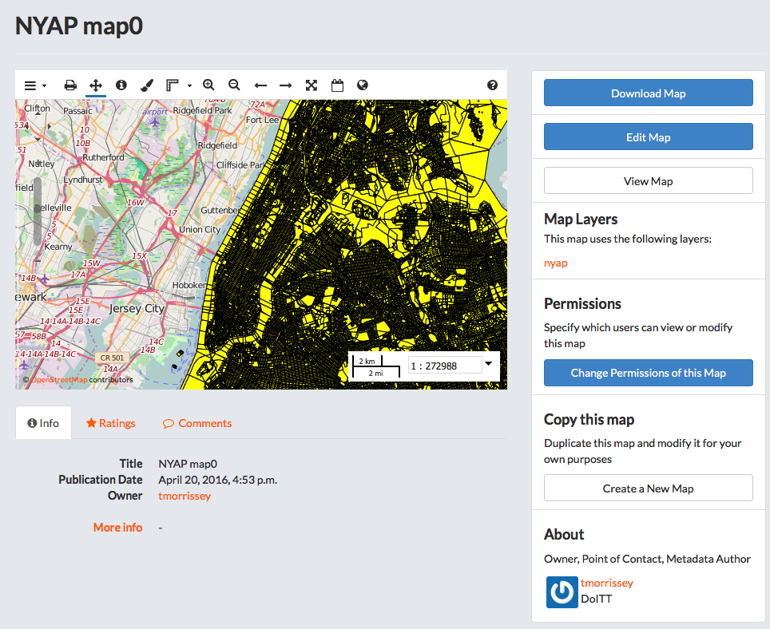

Working with Maps
=================

Maps are comprised of various layers and their styles. Layers are available as local layers, or they can be remote layers, served from other web servers. Exchange maps can be manipulated via map zoom and extent, layer ordering, and style.

Create a Map
------------

New maps can be created several ways. You can create a new map in the Explore Maps section, or from one or more layers.

Create a new map
^^^^^^^^^^^^^^^^

Click :guilabel:`Maps` link on the Boundless Exchange toolbar at the top of the page.

.. figure:: img/bex-toolbar.png

Click the :guilabel:`Create a New Map` button.

Create a new map from a layer
^^^^^^^^^^^^^^^^^^^^^^^^^^^^^

Click :guilabel:`Layers` link on the Boundless Exchange toolbar at the top of the page.

.. figure:: img/bex-toolbar.png

Click :guilabel:`Create a Map` button next to a layer. A new map will open with the layer as part of the map.

Create a new map from multiple layers
^^^^^^^^^^^^^^^^^^^^^^^^^^^^^^^^^^^^^

#. Click the :guilabel:`Shopping Cart Icon` button next to each of the layers you’d like to add to your map. The layers will display in your Cart.

#. Click the :guilabel:`Create a Map` button to add all of the layers to a new map.

   .. figure:: img/create-map-from-cart.png

   Remove a layer from the cart by clicking the :guilabel:`X` button next to its name.

   A new map will open with all of the layers displayed.

Add layers to a map
-------------------

Once you have your map opened, you can add additional layers.

#. Click the :guilabel:`Add Layer (+)` button in the Layers field.

   .. figure:: img/maps-add-layers.png

   The Add Layers dialog box will open. From here you can select which layer(s) you would like to add by clicking the checkbox next to the layer’s name.

   .. figure:: img/maps-add-layers-dialog.png

#. Click the Add button when you have selected the layers you want to add.

Add layers from another server
^^^^^^^^^^^^^^^^^^^^^^^^^^^^^^

You have the ability to add layers from a server other than the local Geoserver you’re working on. You can add web mappings servers (WMS), tile servers, MapQuest, MapBox and OpenStreetMap, for example.

#. Click the :guilabel:`Add Layer (+)` button in the Layers field.

#. Click the drop down menu to select a server. Click **Add New Server** to add one that is not listed.

#. Add the type of server (WMS or TMS), a name for the server and the URL in the Add Server dialog box.

   .. figure:: img/maps-add-server.png

#. Click the Add button to save it to the list of available servers. Once it is added, you can select the new server from the list, and add additional layers to the map.

Change layer order
^^^^^^^^^^^^^^^^^^

Layers on a map are drawn from bottom to top. The top layer in your list will display on top of any layers below it. Each layer will appear in the order it is displayed in your list. Sometimes a layer may need to be reordered so it can be more clearly displayed.

#. Click on the name of the layer you want to reorder.

#. Drag the layer up or down to the position you’d like the layer to be in.

Toggle layer visibility
^^^^^^^^^^^^^^^^^^^^^^^

.. figure:: img/toggle-layer-visibility.png

#. Click the :guilabel:`Toggle Visibility` button to turn a layer off.

#. Click the :guilabel:`Toggle Visibility` button again to turn a layer back on.

Toggle Visibility allows you to turn a layer’s display off and on without having to remove the layer form the map completely.

Zoom to data
^^^^^^^^^^^^

The Zoom to data button allows you to center the map quickly on a particular layer. It is particularly convenient when you need to quickly return to the extent of the data for that layer.

#. Click a layer in the layer list.

#. Click the Zoom to data button. The map will zoom in to and center on that particular layer extent.

   .. figure:: img/map-zoom-to-data.png

.. important:: If a layer’s visibility is dependent on scale, and the data extent is at a lower scale, you will still need to zoom in to be able to view the data.

Show layer info
^^^^^^^^^^^^^^^

Information about a layer is available in the map by clicking the Show Layer Info button. Show Layer info will include server information, basic metadata, and the projection (SRS).

#. Click on a layer name in the layer list to expand the layer options.

#. Click the Show layer info button.

   .. figure:: img/show-layer-info.png

   The layer Info window will display.

   .. figure:: img/layer-info.png

Remove a layer from the map
^^^^^^^^^^^^^^^^^^^^^^^^^^^

#. To remove a layer from the map, click the name of the layer you’d like to remove, and click the Remove layer button in the layer tools.

   .. figure:: img/remove-a-layer.png

#. Click the Yes button in the confirmation dialog box.

   .. figure:: img/confirm-remove-layer.png

Get feature information
^^^^^^^^^^^^^^^^^^^^^^^

To get information in a vector layer, simply click on a feature on the map. Once you click the feature, the information window will display. The point of the information window will touch the feature you clicked.

.. figure:: img/get-feature-info.png

Change attribute visibility
^^^^^^^^^^^^^^^^^^^^^^^^^^^

Individual attribute visibility can be turned off and on in a feature window. This can make managing large numbers of attribute fields in a layer easier.

#. Click the layer name in the layer list on the map. The layer’s additional options will display.

   .. figure:: img/toggle-attribute-visibility.png

#. Click on the visibility button for an individual icon to toggle the visibility off and on.

#. Click a feature on the map from that layer. It will no longer appear, as it has been toggled off.

Using the Legend
^^^^^^^^^^^^^^^^

A legend displayed the symbols used for vector layers in a map. It can be toggled off and on to maximize screen space when necessary.

.. figure:: img/maps-legend.png

Click the Toggle Legend button to toggle the legend off and on.

.. figure:: img/toggle-legend.png

Save a map
^^^^^^^^^^

Saving a map allows you to maintain your preferences for the next use, as well as makes it available for other Exchange users.

#. Click the Save this map button.

   .. figure:: img/save-map.png

#. Add a title and an abstract for your map so it is searchable by others. Click the Save button to save your changes. The name will be reflected in the title, and replace “New Map.”

   .. figure:: img/save-this-map.png

   The Map is now saved in the list of maps on the Maps page.

Create a copy of a map
^^^^^^^^^^^^^^^^^^^^^^

You are able to use an existing map as a starting point for another map. This allows you to incorporate the work others have done without changing their maps.

#. Click the :guilabel:`Save this map` button on the toolbar.

#. Add a title and abstract for the map.

#. Click the :guilabel:`Save Copy` button .

A copy of the original map is now saved in the list of maps on the Maps page.

Managing Maps
-------------

Every map has it’s own page that provides more information about the map along with other options such as permissions and metadata. To get to the page for a map, click on the name of the map.

.. figure:: img/manage-maps-details.png

The map detail page provides a thumbnail view of the map, along with information about the map. It also tells you the layers that are used in the map.

Download Data Layers
^^^^^^^^^^^^^^^^^^^^

This will allow you to download the contents of the map that are stored in Exchange. It does not download data from other servers, however.

#. Click the :guilabel:`Download Map` button.

#. Select Download Data Layers.

   .. figure:: img/download-data-layers.png

   If multiple layers exist, you will be able to select one or more of the available layers. For example, in this map, the only layer associated to it is the **nyap** layer, as shown in the Map Layers section.

   .. figure:: img/map-uses-this-layer.png

#. Select the layer(s) that you want to download individually or the :guilabel:`Start downloading this map` button to begin downloading.

Download Web Map Context
^^^^^^^^^^^^^^^^^^^^^^^^

The Web Map Context (WMC) is an open geospatial consortium (OGC) standard for metadata describing a map service.

#. Click the :guilabel:`Download Map` button.

#. Select Download Web Map Context from the menu.

   .. figure:: img/download-data-layers.png

   A new tab will open with the XML for the web map context.

Edit Map Metadata
^^^^^^^^^^^^^^^^^

You can edit the information about the map.

#. Click the :guilabel:`Edit Map` button

#. Click the **Edit** button under Metadata on the Edit Map menu.

   .. figure:: img/edit-map.png

   In the metadata page, fill in the fields with information about the map. The more information you provide, the better others will understand your map.

   * Click the **Update** button at the top or bottom of the page to save your changes.

Set Map Thumbnail
^^^^^^^^^^^^^^^^^

By default the thumbnail images for maps will only have the vector layers. In order to include the background map you will need to use the Set Map Thumbnail button.

#. Pan and/or zoom the inset map on the **Map Details** page so that it’s centered on the view you would like for the map thumbnail.

#. Click the :guilabel:`Edit Map` button.

#. Click the :guilabel:`Set` button under Thumbnail on the Edit Map menu.

   .. figure:: img/edit-map.png

   This will set the map thumbnail with the base map and layers included.

.. figure:: img/old-thumbnail.png

   Old Thumbnail

.. figure:: img/new-thumbnail.png

   New Thumbnail

Edit Map Permissions
^^^^^^^^^^^^^^^^^^^^

The map permissions determine which users can view or edit a map. The permissions can be set to establish:

* Who can view it?
* Who can download it?
* Who can change metadata for it?
* Who can manage it? (updated, delete, change permissions, publish/edit)

  * Click the :guilabel:`Change Permissions of this Map` button in the Permissions section.

    .. figure:: img/permissions.png

  * Establish the permissions for viewing, editing, and managing according to your needs.

    .. figure:: img/set-resource-permissions.png

  * Click the **Apply Changes** button to save changes.

Remove a Map
^^^^^^^^^^^^

You are able to remove a map from Exchange. This will remove the map for all users.

#. Click the :guilabel:`Edit Map` button.

   .. figure:: img/edit-map.png

#. Click the red **Remove** button under Map in the Edit Map menu.

#. Click **Yes, I am sure** to confirm.

   .. figure:: img/confirm-remove-map.png
