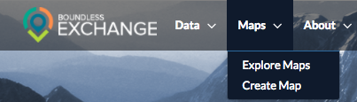
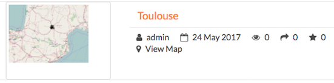

Working with Maps
=================

Maps are comprised of various layers and their styles. Layers are available as local layers, or they can be remote layers, served from other web servers. Exchange maps can be manipulated via map zoom and extent, layer ordering, and style.

Create a map
------------

Maps can be created in the Explore Maps section, or from one or more layers in Explore Maps.

Create a new map
^^^^^^^^^^^^^^^^

1. Select the :guilabel:`Maps` link on the Boundless Exchange toolbar.

2. Click **Create Map** in the drop-down menu.

A new map environment will open, and you can begin working.

Create a new map from a single layer
^^^^^^^^^^^^^^^^^^^^^^^^^^^^^^^^^^^^

Maps can be created in the Explore Layers section, or from one or more layers in Explore Maps.

#. Select the :guilabel:`Data` link on the Boundless Exchange toolbar, and click **Layers** in the drop-down menu.

.. figure:: img/data-drop-down.png

2. Select the **Create a Map** link under the layer you'd like to add to the map. A new map will open with the layer as part of the map.

Create a new map from multiple layers
^^^^^^^^^^^^^^^^^^^^^^^^^^^^^^^^^^^^^

#. Click the :guilabel:`Shopping Cart` icon next to the layers you'd like to add to your map. They will display in your cart until you are ready to build your map.

#. Click the :guilabel:`Create a map` button to add all of the layers to a new map.

   .. figure:: img/add-to-workspace.png

*Remove a layer from the cart by clicking the* :guilabel:`X` *next to its name.*

A new map will open with all of the layers displayed.

Add layers to a map
-------------------

You can add layers to the map from within the map environment using the Add Layer feature. Layers can be added from either the local geoserver within Exchange, or from a registry.

The local geoserver hosts layers that have been added to Exchange by other registered users. Local layers can be discovered through an advanced search from the Boundless Exchange homepage, from the Explore Layers page, and from within the map.

Registry is a system for building, maintaining, and deploying a public registry of web map services of various types, OGC and Esri services. From a user’s perspective, registry integration is within the mapping client. Rather than having to add multiple services into Exchange, registry exposes external services and allows the user to add them to their map.

#. Click the Add Layer :guilabel:`(+)` button in the Layers field.

   .. figure:: img/add-layer-button.png

The Add Layers window will open. A list of available layers will display on the right, but you can refine your search to find specific information.

   .. figure:: img/add-layers.png

2. **Using the map -** Zoom in or out to your area of interest. The list of available layers will change to show you what is within the map extent (minus any layers currently on your map).

Hover your mouse over a layer in the results list. A bounding box will display over the layer’s coverage area. Each layer will tell you whether it is from the local geoserver, or the registry.

  .. figure:: img/add-layer-map.png

3. **Keywords -** Add keywords to find specific layers. Words associated in the metadata, and the title are used for results. Select the Clear link to remove the filter.

  .. figure:: img/keywords.png

4. **By owner -** Click the checkbox next to an individual’s name to return layers added by that user. If you are collaborating on a project, this is a fast way to find layers from your team members.

  .. figure:: img/by-owner.png

5. **Date Created -** Click and drag the time bar to filter layers by their creation date.

6. **Category -** Click the checkbox next to one or more categories to filter layers by their metadata category.

7. Once your results have been filtered, select the layers you’d like to add to your map from the results list, and click the :guilabel:`Add Layers` button. Your layer(s) will now display on your map, and in the layers list.

  .. figure:: img/added-layers.png

Change layer order
^^^^^^^^^^^^^^^^^^

Layers on a map are drawn from bottom to top. The top layer in your list will display on top of any layers below it. Each layer will appear in the order it is displayed in your list. Sometimes a layer may need to be reordered so it can be more clearly displayed.

#. Click on the name of the layer you want to reorder.

#. Drag the layer up or down to the desired position.

Toggle layer visibility
^^^^^^^^^^^^^^^^^^^^^^^

Toggle Visibility allows you to turn a layer’s display off and on without having to remove the layer form the map completely.

  .. figure:: img/toggle-layer.png

#. Click the Toggle Visibility button to turn a layer off.

#. Click the Toggle Visibility button again to turn a layer back on.

Zoom to data
^^^^^^^^^^^^

The Zoom to data button allows you to center the map quickly on a particular layer. It is particularly convenient when you need to quickly return to the extent of the data for that layer.

#. Click a layer in the layer list.

#. Click the :guilabel:`Zoom to data` button. The map will zoom in and center on that particular layer's extent.

  .. figure:: img/zoom-to-data.png

.. important:: If a layer’s visibility is dependent on scale, and the data extent is at a lower scale, you will need to zoom in to view the data.

Show layer info
^^^^^^^^^^^^^^^

Information about a layer is available in the map by clicking the Show Layer Info button. Show Layer Info will include server information, basic metadata, and the projection (SRS).

#. Click on a layer name in the layer list to expand the layer options.

#. Click the :guilabel:`Show Layer Info` button.

  .. figure:: img/show-layer-info.png

The Layer Info window will display.

   .. figure:: img/show-info.png

Remove a layer from the map
^^^^^^^^^^^^^^^^^^^^^^^^^^^

#. To remove a layer from the map, click the name of the layer you’d like to remove, and click the :guilabel:`Remove layer` button in the layer tools.

   .. figure:: img/remove-layer.png

#. Click the :guilabel:`Yes` button to confirm.

   .. figure:: img/confirm-remove.png

Get feature information
^^^^^^^^^^^^^^^^^^^^^^^

To get information in a vector layer, simply click a feature on the map. Once you click the feature, the information window will display. The point of the information window will touch the feature you clicked.

.. figure:: img/get-feature-info.png

Change attribute visibility
^^^^^^^^^^^^^^^^^^^^^^^^^^^

Individual attribute visibility can be turned off and on in a feature window. This can make managing large numbers of attribute fields in a layer easier.

#. In the layers list on the map, select on the layer whose attribute visibility you'd like to change.  The layer’s additional options will display.

2. Click the :guilabel:`Show Attribute Visibility` button to open the list of attributes for the layer.

  .. figure:: img/show-attribute-visibility.png

3. Click on the :guilabel:`Toggle Visibility` button for an attribute to turn it off and on.

  .. figure:: img/toggle-attribute-visibility.png

4. Select a feature on the map from that layer. The attribute will no longer appear in the feature information window, as it has been toggled off. Repeat these steps to toggle it back on.

Search for locations
^^^^^^^^^^^^^^^^^^^^

FFind a specific location on the map simply by typing the name of a place, zip code, address or lat/long (DMS or DD) in the Search Locations text box. Click the search button to return a list of possible matches. Scroll through the list, and select one of the matches. The map will recenter on that location. This is a simple search, and does not allow wildcards.

  .. figure:: img/search-locations.png

Using the legend
^^^^^^^^^^^^^^^^

A legend displayed the symbols used for vector layers in a map. It can be toggled off and on to maximize screen space when necessary.

.. figure:: img/legend.png

Click the Toggle Legend button to toggle the legend off and on.

Additional map features
^^^^^^^^^^^^^^^^^^^^^^^

There are additional features which allow you to change your coordinate display, your full screen extent, and your map scale.

1. Click the :guilabel:`Toggle Full Screen` button to maximize your map environment to the full screen.

  .. figure:: img/toggle-full-screen.png

2. Click the :guilabel:`Zoom In (+) / Zoom Out (-)` buttons, or click and drag the scroll bar to zoom in and out on the map. Click the :guilabel:`Zoom to World` button to return to the world view.

  .. figure:: img/zoom-buttons.png

3. Click the :guilabel:`Switch Coordinate Display` button, in the lower left corner of your map, to change the coordinate system. Your available options are DMS, DD (or XY) and MGRS. Click the button additional times to cycle through to your desired display. Your scale bar is located just above the coordinate display.

  .. figure:: img/coord-display.png

Measure distance or area
^^^^^^^^^^^^^^^^^^^^^^^^

You can measure distance or areas on your map using the Measure tool.

1. To measure an area or distance on the map, select the Measure field. The measure tools will open, and you can select whether you want to measure a line distance, or an area.

2. **Area** - Click the :guilabel:`Area` button in the Measure tools. Begin drawing by clicking your mouse on your map at your starting point. Click subsequent points around the area you want to measure.  To complete your measurement, you will need to ensure you close your polygon by clicking on your starting point.

  .. figure:: img/measure-area.gif

  **Line** - Click the Length button in the Measure tools. Begin drawing by clicking your mouse at your starting point. Click subsequent points along the route or feature you want to measure.

  .. figure:: img/measure-line.gif

3. To complete your measurement, click your mouse at the end distance. The line will turn from a bold blue to a thin blue line. The distance will display as meters/kilometers, miles or feet, depending which unit you have selected.

4. Click the :guilabel:`Stop Measuring` button to clear your map and measurements.

Save a map
^^^^^^^^^^

Saving a map allows you to maintain your preferences for the next use, as well as makes it available for other Exchange users.

#. Click the Save this map button.

  .. figure:: img/save-map.png

2. Add a title and an abstract for your map so it is searchable by others. Click the Save button to save your changes. The name will be reflected in the title, and replace “New Map.”

  .. figure:: img/save-this-map.png

The Map is now saved in the list of maps on the Maps page.

Create a copy of a map
^^^^^^^^^^^^^^^^^^^^^^

You can use an existing map as a starting point for another map. This allows you to incorporate the work others have done without changing their maps.

#. Click **Maps** on the  Boundless Exchange toolbar, and select Explore Maps in the drop-down menu.

2. Select on the map you would like to copy. This will open the map details page.

Click the :guilabel:`Create a New Map` button under the Copy this map section.

   .. figure:: img/copy-this-map.png

A new map will open, populated with all of the layers of the map you copied.

3. Click the :guilabel:`Save this map` button on the toolbar.

4. Add a new title and an abstract, possibly indicating this is a copy of another map.

5. Click the :guilabel:`Save Copy` button.

Your new map is now saved, and can be accessed from the maps page.

.. important:: You are only copying the map. Any changes you make to the layer (data set) will affect both maps. Copying the map would primarily be used to make visual changes.

Managing Maps
-------------

Every map has its own details page, which provides more information about the map, the metadata and who has what permissions for making edits. To get to the details page for a map, click on the map title.

  .. figure:: img/manage-maps-details.png

The map details page provides a view of the map, along with information about the map. It also tells you which layers are used in the map.

  .. figure:: img/map-details-page.png

Download data layers
^^^^^^^^^^^^^^^^^^^^

Here you can download the contents of a map that is stored in Exchange. It does not download data from other servers, however.

#. Click the :guilabel:`Download Map` button.

#. Select **Download Data Layers**.

  .. figure:: img/download-data-layers.png

If multiple layers exist, you will be able to select one or more of the available layers.

  .. figure:: img/map-layers.png

3. Select the layer(s) you want to download individually, or the :guilabel:`Start downloading this map` button to begin downloading.

Download Web Map Context
^^^^^^^^^^^^^^^^^^^^^^^^

The Web Map Context (WMC) is an open geospatial consortium (OGC) standard for metadata describing a map service.

#. Click the :guilabel:`Download Map` button.

#. Select **Download Web Map Context** from the menu.

   .. figure:: img/download-data-layers.png

A new tab will open with the XML for the web map context.

Edit map metadata
^^^^^^^^^^^^^^^^^

Metadata plays an important role for maps. It describes the map in a way that the legend does not; why it was created, the date it was published, and who created it, for example. When a map is updated, it is important to update the metadata, as well. You can edit the information about the map if you have the proper permissions.

#. Click the :guilabel:`Edit Map` button

#. Click the :guilabel:`Edit` button under Metadata on the Edit Map menu.

   .. figure:: img/edit-map.png

#. In the metadata page, fill in the fields with information about the map. The more information you provide, the better others will understand your map.

#. Click the :guilabel:`Update` button at the top or bottom of the page to save your changes.

Set map thumbnail
^^^^^^^^^^^^^^^^^

By default the thumbnail images for maps will only have the vector layers. In order to include the background map you will need to use the Set Map Thumbnail button.

#. Pan and/or zoom the inset map on the **Map Details** page so that it’s centered on the view you would like for the map thumbnail.

#. Click the :guilabel:`Edit Map` button.

#. Click the :guilabel:`Set` button under Thumbnail on the Edit Map menu.

   .. figure:: img/edit-map.png

This will set the map thumbnail with the base map and layers included.

.. figure:: img/manage-maps-details.png

   *Old Thumbnail*

   *New Thumbnail*

Create a custom thumbnail
^^^^^^^^^^^^^^^^^^^^^^^^^

Custom images related to your map can be created, and will display next to the map on the Explore Maps page.

1. From the map’s info page, click the :guilabel:`Metadata Detail` button.

  .. figure:: img/metadata-detail.png

2. Click the :guilabel:`Choose File` button to browse to the image.

3. Click the :guilabel:`Change Image` button. The new image will display.

Edit map permissions
^^^^^^^^^^^^^^^^^^^^

The map permissions determine which users can view or edit a map. The permissions can be set to establish:

* Who can view it?
* Who can download it?
* Who can change metadata for it?
* Who can manage it (update, delete, change permissions, publish/edit)?

#. Click the :guilabel:`Change Permissions of this Map` button in the Permissions section.

    .. figure:: img/permissions.png

#. Establish the permissions for viewing, editing, and managing according to your needs.

    .. figure:: img/set-resource-permissions.png

#. Click the **Apply Changes** button to save changes.

Remove a map
^^^^^^^^^^^^

You are able to remove a map from Exchange. It is important to note that this will remove the map for all users.

#. Click the :guilabel:`Edit Map` button.

   .. figure:: img/edit-map.png

#. Click the red :guilabel:`Remove` button under Map in the Edit Map menu.

#. Click the :guilabel:`Yes` button to confirm.

  .. figure:: img/remove-map-confirm.png
