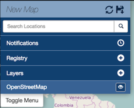

Registry
========

Registry is a system for building, maintaining, and deploying a public registry of web map services of various types, OGC and Esri services. From a user's perspective, registry integration is within the mapping client. Rather than having to add multiple services into exchange, registry exposes external services and allows the user to add them to their map.

Search the registry for a layer
-------------------------------

Create a new map
^^^^^^^^^^^^^^^^

Registry layers can be added to an existing map, but this example demonstrates how to create a new map, and add a registry layer.

#. To create a new map select Maps on the Boundless Exchange toolbar at the top of the page.

   .. figure:: img/bex-toolbar.png

#. Select the :guilabel:`Create` button from the Exchange homepage.

   .. figure:: img/create-map.png

   A new map will open, and Registry will be displayed in the map menu.

Search for a layer
^^^^^^^^^^^^^^^^^^

#. Select the :guilabel:`Registry of layer (+)` button.

   .. figure:: img/registry-of-layer-button.png

#. The **Registry of layers** window will open.

   .. figure:: img/registry-of-layers-window.png

#. Type a search term in the text box to search for a layer related to that term.

   .. figure:: img/search-term.png

   You can filter the layer results by time using either the text boxes or the slide bar.

#. Type a year in the From text box to select a starting time. Then type a year in the To text box to select an end year. Years containing data are represented in the bar graph.

   .. figure:: img/time-filter.png

   You can also click and drag the points on the slide bar to select **From** and **To** dates.

#. Click the :guilabel:`SEARCH` button to submit your search, or the :guilabel:`RESET` button to clear your search terms.

   Your search results will display in a new window.

   .. figure:: img/results.png

Add a layer from the registry to the map
----------------------------------------

Once you have search results from the registry, you can select specific layers to add to your map.

#. Hover your mouse over a layer in the results list. Additional information about the layer will display in the window near the results list.

   .. figure:: img/additional-information.png

#. Select the layer in the search results list to add it to your cart.

   .. figure:: img/search-results.png

   The layer will be highlighted, and will display in the Cart window.

   .. figure:: img/cart.png

#. Select the :guilabel:`ADD` button to add the layer to your map.

   Your layers will now be added to your map menu, and displayed on your map.

   .. figure:: img/results-on-map.png
